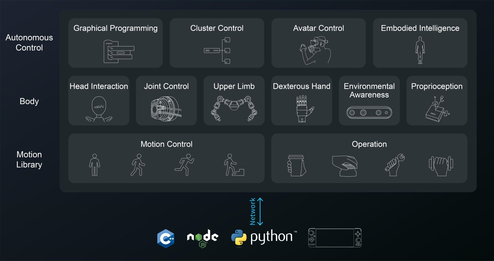

    

## RoCS Robot Control System

> Where precision fuses with robotic mastery.

## What it is

The GR-1 robot software is a sophisticated system that includes an advanced framework designed for precise management and control of robotic systems. It comprises two core components: the upper computer and the lower computer.

The collective elements of the upper computer, encompassing the Control App, Client SDK, and Server API, comprise the Robot Control System, or RoCS. 

This comprehensive framework, along with its robust architectural design, provides developers and operators with the tools necessary for efficient and precise monitoring and remote control of robotic systems, thereby ensuring their seamless and optimal operation.

See the [Quick start](quick_start/quick_start.md) guide for more details.

## Features

* **High Precision Control:** RoCS is designed for achieving highly precise control of robotic systems, making robots excel in various tasks, be it in industrial automation, medical surgery, or other domains.
* **Layered Architecture:** RoCS employs a layered architecture, modularizing functionalities for ease of maintenance and scalability. This simplifies development and integration of various components, enhancing system maintainability.
* **User-Friendly Graphical Interface:** RoCS provides a user-friendly graphical interface (Control App) that enables developers to interact with and monitor robotic systems seamlessly, expediting the development process.
* **Open Source:** Part of RoCS (Client SDK) is open source, offering flexibility and customization opportunities for developers. This fosters community engagement and drives innovation.
* **Efficient Data Transmission:** RoCS's Server API facilitates data transmission through HTTP and WebSocket protocols, ensuring efficient and secure data transfer crucial for real-time control and monitoring.
* **Comprehensive Functionality:** RoCS offers a wide range of functionalities, including sound and video processing, motion algorithms, hardware control, and more, making it suitable for diverse robotic application domains.
* **Integration:** RoCS effectively integrates various components within its layered structure, making it a comprehensive robotic control system capable of meeting diverse application needs.

## Lower Computer

The lower computer, functioning as the analog of the cerebellum in human physiology, specializes in tasks related to motion control. It is responsible for motor control, motion algorithms, hardware driver management, and other critical functions essential for the robot's movement and stability.

## Upper Computer

On the flip side, the upper computer is primarily designed for smooth data exchange and the execution of specific logic applications. Its responsibilities include tasks like receiving and playing audio, real-time transmission of video streams, sending precise instructions to the robot's hardware components, and continuously monitoring the operational status of the robot. All components of the upper computer are collectively referred to as RoCS.

## Layers of RoCS

The RoCS is structured into three distinct layers, each serving a unique and pivotal role:

* **Control App (User Graphic Application)**

  The Control App is an intuitive graphical application tailored for use on terminals external to the robot's physical body, such as computers and mobile devices. Its primary function is to serve as a comprehensive reference for developers, rather than as a consumer-facing application.
* **Client SDK (Client Interface)**

  The Client SDK represents the client-side interface, facilitating interaction with the Robot Control System. It provides developers with a streamlined mechanism for accessing the Server API, thereby enabling the development of customized applications. This layer is open-source, encouraging the development community to create tailored solutions.
* **Server API (Server Interface)**

  Operating within the confines of the robot, the Server API assumes the role of a lightweight data forwarding layer. It leverages HTTP and WebSocket protocols to facilitate the seamless transmission of external commands to the lower computer and the transmission of essential robot data to external entities. Despite its location within the robot, the Server API is considered an integral part of the upper computer. However, due to efficiency and security concerns, it is not available as open-source software.
  The Server API essentially serves as the crucial conduit between the core functions of the lower computer and the external world, ensuring the efficient and secure exchange of data.

## RoCS Architecture

The RoCS architecture is meticulously engineered to provide accurate control and management of robotic systems through a network-based communication system. It allows for seamless interaction with the robot and empowers operators to issue commands and receive real-time feedback. This is achieved by supporting Node.js and Python SDK clients, along with joystick terminals that run the Control App, enabling effective communication with the system.

* **Bottom Layer - Motion Library**

  * The Motion Library, at the bottom layer, handles core functions related to motion control and operational control.
  * It encompasses motor control, motion algorithms, and operational control, ensuring precise and coordinated robot movements.
* **Middle Layer - Body**

  * The middle layer, known as the Body, represents the physical embodiment of the robot and is responsible for various aspects of its operation.
  * Components for head interaction, joint control, upper limb dexterity, hand environmental awareness, and proprioception contribute to the robot's physical capabilities and sensory perception.
* **Upper Layer**

  * The uppermost layer is versatile and dynamic, incorporating advanced functionalities such as graphical programming, cluster control, avatar control, and embodied intelligence.
  * This layer enables higher-level tasks, including human-robot interaction, decision-making, and intelligent behaviors.

The RoCS architecture offers a comprehensive framework for controlling and managing robots, spanning from low-level motion control to high-level intelligent behaviors and human-robot interaction，making it a versatile tool in various robotic applications.
