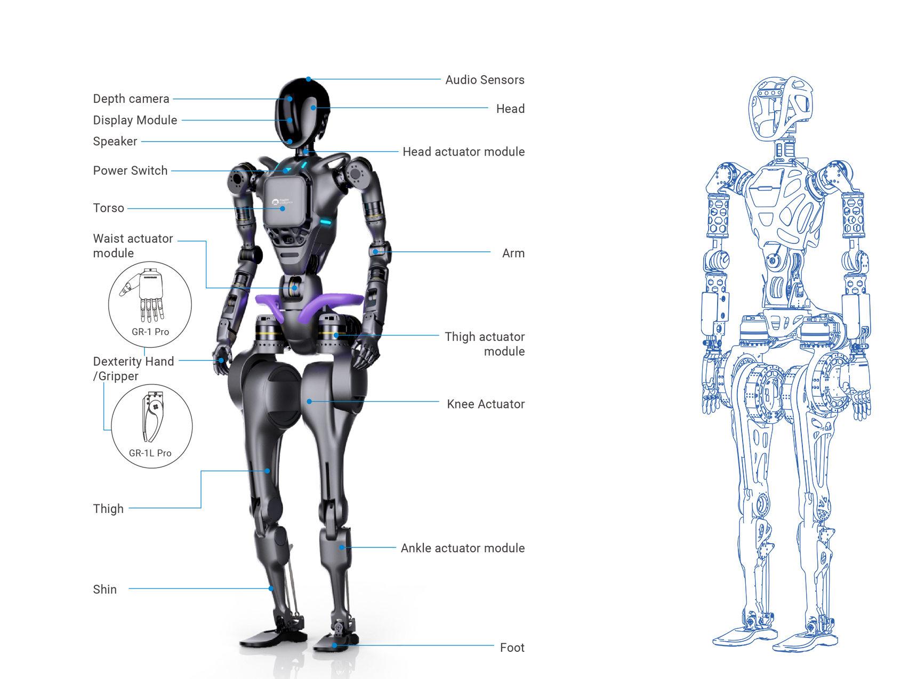

# About GR-1

The Fourier GR-1 represents a versatile humanoid robot, boasting a configuration of up to 40 FSA joints capable of delivering peak joint torque of 230 N.m. Its advanced whole-body control algorithm empowers the robot with an impressive 44 degrees of freedom.

This robotic marvel exhibits remarkable human-like agility and motion kinematics, including the ability to perform tasks such as:

* Straight leg walking
* High-speed walking
* Agile obstacle avoidance
* Graceful slope ascension and descension
* Robust response to impacts
* Seamless human-robot collaboration in task execution.

These capabilities position the Fourier GR-1 as a promising platform for the future of "Embodied AI", which is widely believed to be the next wave of artificial intelligence. As a carrier for artificial intelligence to interact with the physical world, embodied intelligence combines artificial intelligence technology with robot entities, so that the "brain" has a disposable, perceivable, interactive, and actionable "body", which brings great convenience and benefits as an important partner and assistant of human beings.

The Fourier GR-1's scalability lends itself to the validation of various AI models and algorithms, opening up exciting possibilities for applications in industries, rehabilitation, household, and research.

<h1>GR-1 Specifications</h1>

## Mechanical

| Items         | Value                                |
| :------------ | :----------------------------------- |
| Standing size | 1650 x 515 x 320 mm                  |
| Arm span      | 1680 mm                              |
| Net weight    | ≈ 55 kg                              |
| Materials     | Aluminum alloy, engineering plastics |

## Electrical

| Items                | Value  |
| :------------------- | :----- |
| Power supply voltage | 46.2 V |
| Max.  power          |        |

## Performance

| Items                    | Value                                |
| :----------------------- | :----------------------------------- |
| Walk speed               | 5 km/h                               |
| Single hand payload      | ≈ 3 kg                               |
| Basic computing capacity | 7-13700h 6P+8E 20 threads 1.6/5.0GHz |

## Joints

| Items                 | Value                                           |
| :-------------------- | :---------------------------------------------- |
| Total joint actuators | 44                                              |
| FSA actuators         | 32                                              |
| Max. joint torque     | 230 N.m                                         |
| Operating voltage     | 12 - 60 V                                       |
| Rated voltage         | 46 V                                            |
| Max. current          | 40 A                                            |
| Compliance standards  | GB 17625.1-2012，GB 4943.1-2011，GB/T 9254-2008 |

## Sensor

| Items        | Value     |
| :----------- | :-------- |
| Depth camera | Realsense |
| IMU          | √         |

## Battery and adapter

| Items                   | Value              |
| :---------------------- | :----------------- |
| Battery capacity        | 483 Wh             |
| Battery type            | Lithium battery    |
| Battery nominal voltage | 40 V               |
| Charging limit voltage  | 46 V               |
| Rated capacity          | 5.2Ah 112.3Wh      |
| Cruise duration         | ≈ 60 min           |
| Walk cruise duration    | ≈ 45 min           |
| Full charge             | 315 min            |
| Adapter input           | 100-240 V, 50/60Hz |
| Adapter output          | MAX. 46 V, 2 A     |

## Operating system and connection

| Items               | Value                                                                 |
| ------------------- | --------------------------------------------------------------------- |
| OS                  | Ubuntu20.04+ROS 2                                                     |
| External interfaces | HDMIx1，Type-C x 3(fast charge，USB，peripheral extension ports)      |
| Wireless connection | Wi-Fi，EEE 80211a/b/g/n/ac, bluetooth 4.2                             |
| Host                | ASUS 13th Generation - Dawn X MINI Commercial and Home Office Desktop |
| Model               | PN64171RZ                                                             |
| CPU                 | I7 13700H                                                             |
| Memory              | 16 G                                                                  |
| SSD                 | 512 G                                                                 |
