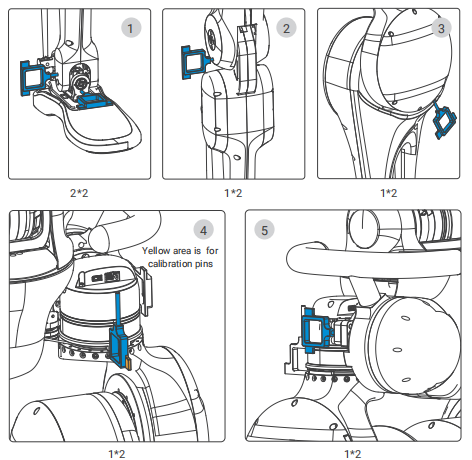
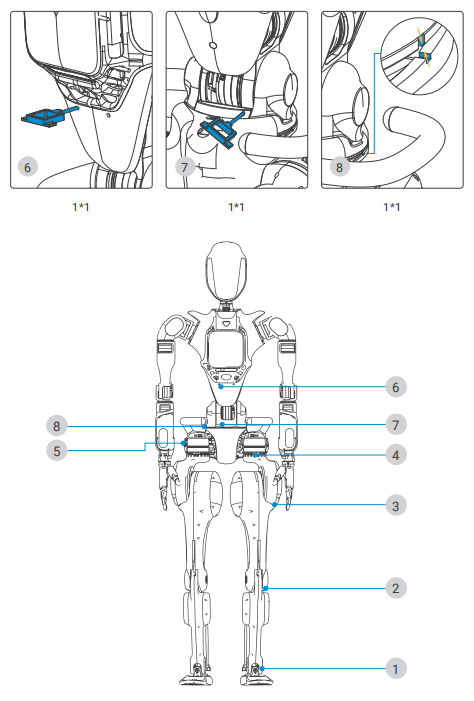

# Faults, Causes, and Solutions

| Fault Description                 | Possible Causes                                          | Solutions                                                                                                                                                  |
| --------------------------------- | -------------------------------------------------------- | ---------------------------------------------------------------------------------------------------------------------------------------------------------- |
| Robot cannot start normally       | Upper limbs not calibrated                               | 1. Turn off the embedded robot computer.<br />2. Perform calibration according to the procedures stated in the following section.<br />3. Start the robot. |
|                                   | Abnormal wiring connections                              | Check the wiring connections of all interfaces and start the robot.                                                                                        |
|                                   | Emergency Stop switch not released                       | Release the Emergency Stop switch and then start the robot.                                                                                                |
| Robot cannot stand or walk stably | Low battery level                                        | Charge the robot.                                                                                                                                          |
|                                   | Actuators overheating resulting from long-time operation | Stop operation, allow for cooling before resuming use.                                                                                                     |

For any other operational irregularities, kindly reach out to Fourier Intelligence after-sales engineers for expert assistance.

## Calibration Procedure

If the upper limb posture appears abnormal or if the motors have been replaced, you should perform zero calibration. The calibration procedure is as follows:

1. Turn off the robot actuators and the embedded robot computer.
2. Insert the calibration tool into the robot's lower limbs and waist joint pinholes. There are `6*2` zero-position pinholes in the lower limbs and `3*1` zero-position pinholes in the waist.

   
3. Connect the embedded robot computer to a monitor through the extension dock. Plug in a keyboard and a mouse into the extension dock as well.
4. Release the Emergency Stop switch and power on the embedded robot computer. The login password is `fftai2015`.

5. Open a terminal and do the following:

   Run the following command:

      ```powershell
      cd ~/Documents/server_app/bin/pythonscripts/
      python3 abs_run.py

      ```

      If prompted with `get abs angle complete!`, it indicates  getting absolute angle successfully.

   Run the following commands:

      ```powershell
      python3 checkabsjson.py
      python3 setmotorzeropos.py
      ```

      If prompted with `Set Motor Zero Position Success`, it signifies successful zero-point setting.
5. Shut down the embedded robot computer.
6. Press down the Emergency Stop switch.
7. Remove the calibration tools. Ensure that all calibration tools have been removed before proceeding with other operations.
