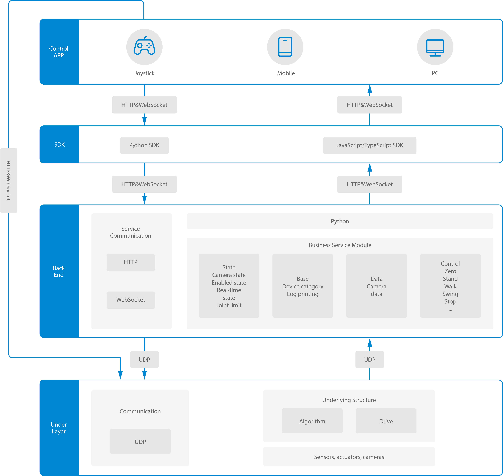

The RoCS (Robot Control System) architecture is intricately designed, featuring four distinct layers to ensure seamless communication and robust operation.

1. **APP Layer (User Interface):**
   * At the topmost layer, the APP layer serves as the user interface, facilitating interaction through devices such as joysticks, mobile devices, or PCs.
   * **Communication:** This layer establishes a connection with the SDK layer, employing both HTTP and WebSocket protocols for flexible and real-time data exchange.
2. **SDK Layer (Software Development Kit):**
   * The SDK layer offers support for Python and JavaScript/TypeScript, providing developers with the flexibility to choose their preferred programming language.
   * **Communication:** Interactions with the Backend layer occur through a dynamic combination of HTTP and WebSocket protocols, allowing for versatile communication channels.
3. **Backend Layer (Service Layer):**
   * The crux of RoCS lies in the Backend layer,  responsible for core control logic processing:
     interface management, network communication, emotional computing and other core intelligent receiving instructions, coordination of movements, and planning of control signals
     * **State Management:** Manages diverse states including camera status, robot activation, real-time updates, and joint limit information.
     * **Base Service:** Incorporates essential services like device categorization and logging functionalities.
     * **Data Service:** Manages the flow of data, especially from cameras, ensuring efficient data handling.
     * **Motion Control:** Encompasses a spectrum of motion commands, from fundamental actions like returning to zero position to complex maneuvers like walking, swinging, and stopping.
   * **Communication:** The Backend layer establishes communication with the underlayer using the UDP protocol, ensuring low-latency and reliable data transfer.
4. **Underlayer (Algorithm and Drive):**
   * At the foundation of the architecture, the underlayer orchestrates the intricate dance of hardware, sensors, actuators, and algorithmic processes.
   * **Communication:** Leveraging the UDP protocol, this layer ensures efficient communication, minimizing latency and optimizing the interaction between the algorithmic core and the hardware.

The meticulously structured architecture of RoCS facilitates modularity and scalability, providing developers with a powerful framework to craft sophisticated applications for robot control. Whether leveraging SDK capabilities, accessing business services, or interacting with the underlying hardware, RoCS empowers developers with a comprehensive and adaptable system architecture.
