# Welcome to the RoCS Remote Control App User Guide

### 1. Start Screen

### 2. Login Screen (Not Connected)

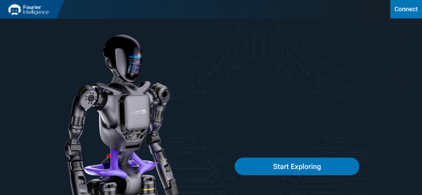
1. Enter the connection page.
2. Start exploring 
   * at this point it is still in the unconnected state, also enter the connection page.

### 3. Device Connection

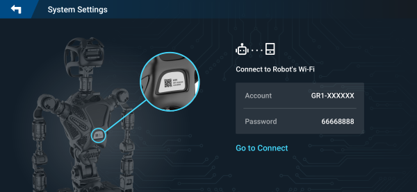
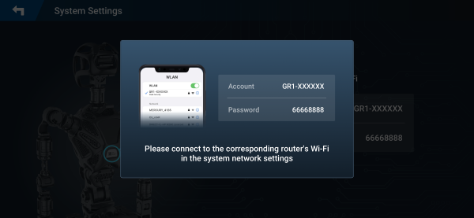

1. The robot's WiFi information can usually be obtained from the label on the back. If not, you can find the WiFi name with the corresponding prefix according to the prompt of the initial account, and the initial password is generally the unified password when it comes out of the factory.
2. Go to connect
3. pop-up box prompts to connect by yourself in the phone WiFi settings.

### 4. Login Screen (Connected)

1. When the humanoid robot and app are connected at this time, it displays the current robot's battery level and shows the connection status.
2. Start exploring
   * directly enter the control page.

### 5. Loading Screen

Wait a few seconds for loading time, and then enter the subsequent control page.

### 6. Control Screen (Remote Control Mode)

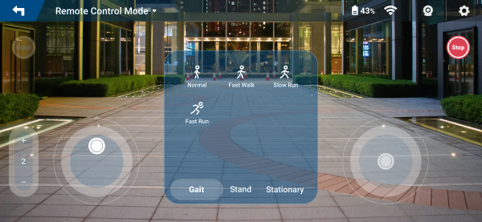
1. Return to the previous level.
2. Switch current mode, you can enter developer mode from here.
 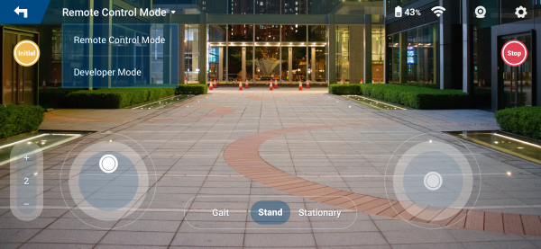
3. Image transmission switch, whether to turn on or off real-time images.

  

4. Enter the settings screen.
5. Calibration
   * send a zero (Zero) command to the robot.
6. Emergency stop
   * send an emergency stop (Stop) command to the robot.
7. Switch speed gears, currently can switch between 1 and 5 gears.
8. Send action commands to the robot, divided into gait movement, standing and stationary movement.
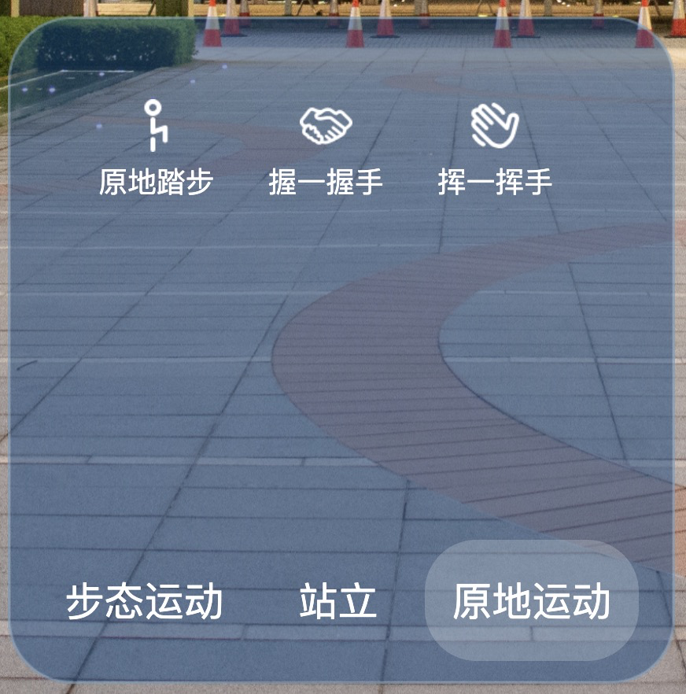

9. Virtual touch joystick, left side controls robot's forward and backward walking and left and right turning, right side controls head's up and down and left and right movement.

### 7. Developer Mode

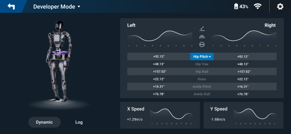

1. Switch Log logs and dynamic display.
2. Real-time data line charts on both sides, updated once every second, specific display line chart data according to ③ and ④ for switching display.
3. From top to bottom correspond to the following table

   |Attribute|Name|Unit|
   |---|---|---|   
   |qa|Angle|Degree|
   |qdota|Speed|Degree/Second|
   |taua|Torque|Newton Meter(N.m)|

4. Real-time joint data table on both sides

   |Attribute|Name|
   |---|---|
   |Hip Pitch| Hip Pitch Angle|
   |Hip Yaw| Hip Yaw Angle|
   |Hip Roll| Hip Roll Angle|
   |Knee| Knee Pitch Angle |
   |Ankle Pitch| Ankle Pitch Angle |
   |Ankle Roll| Ankle Roll Angle |

5. X-axis and Y-axis speed real-time data line chart

### 8. System Settings

1. Connection (Not Connected)
   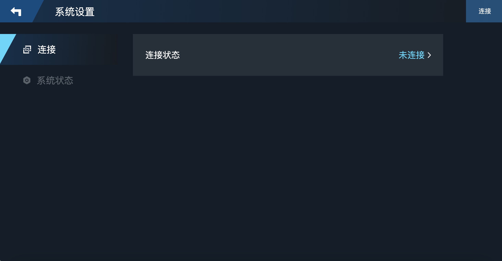
2. Connection (Connected)
   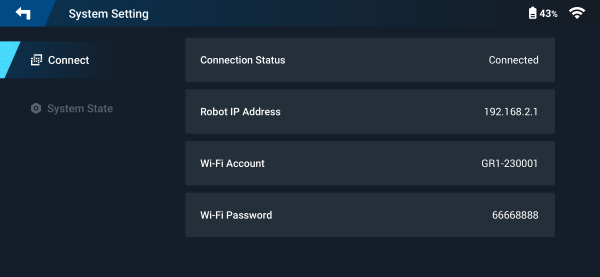
3. System Status
   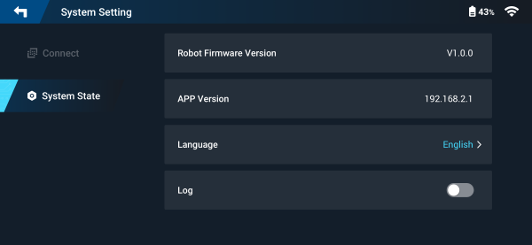
   In APP language, display current system language, and can switch to other system languages from here.
   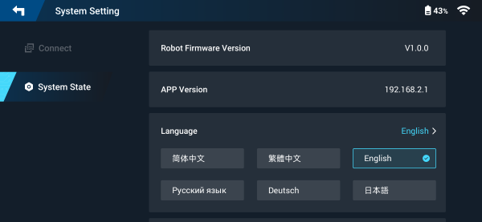