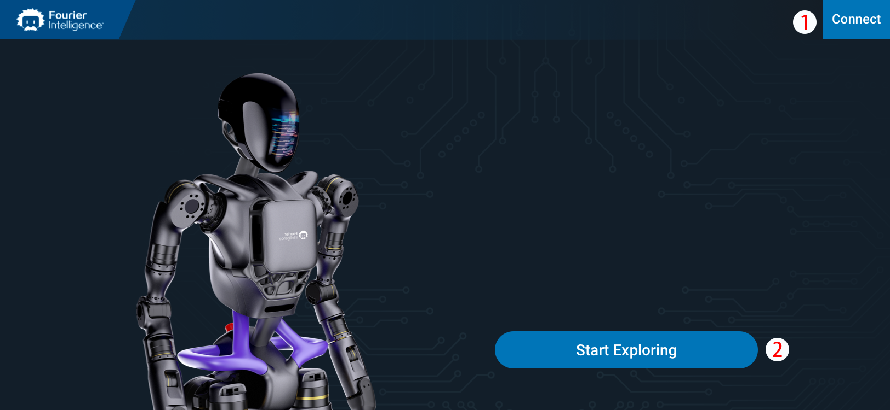
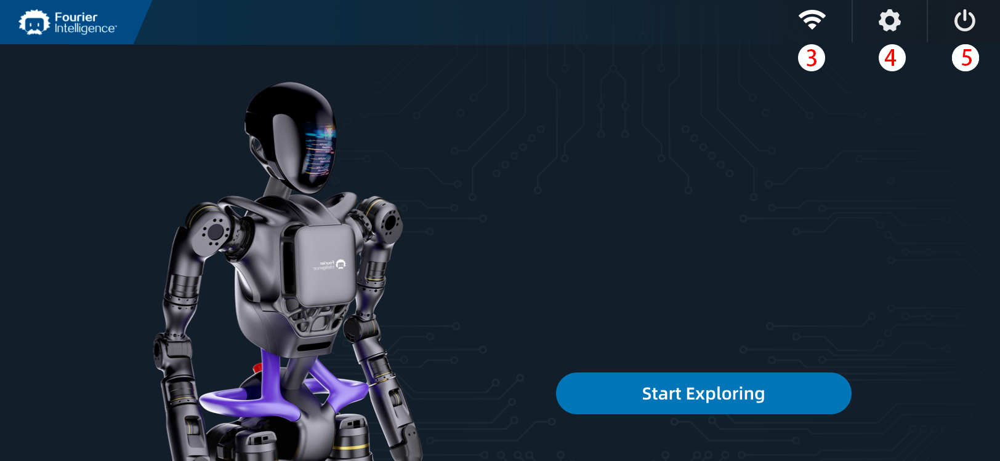

# Login Interface

The login interface is a Vue.js component with interactive elements, including a header, an image of GR robot, a `Start Exploring` button, and a prompt box appearing based on certain user interactions.

It communicates with a Vuex store to retrieve and manage data related to the connection status and robot information. Users can initiate exploration and interact with the application through the provided UI elements.

!> For how the connection status is checked and stored, please refer to [RoCS App Logic Flow](https://fftai.github.io/#/logicFlow?id=rocs-app-logic-flow) for details.

### **Disconnected UI**

Once enter into the login page, connection status will be checked. If not connected, following UI will be displayed.

### **Connected UI**

If connected, following UI will be displayed.

### 1. `Connect` Button

When the `Connect` button is clicked, it invokes the `toConnect()` method, which navigates to the `robotStartup` route, that's, the Robot Startup page, you can set the connection according to the tips in that page.

### 2.  `Start Exploring` Button

When clicked, it invokes the `startExplore()` method, which checks server status via the `control_svr_status` method of the `robot` object. If connected and server status is positive, navigates to the `loading` route; otherwise, navigates to the `robotStartup` route.

The `control_svr_status` method and the `robot` object play a pivotal role in managing the initiation of the `startExplore()` method. When the user clicks, this action triggers the execution of `startExplore()`, a method responsible for commencing exploration. This method relies on the `control_svr_status` method, encapsulated within the `robot` object.

The `control_svr_status` method serves as a mechanism to query the server status through the `robot` object. This inquiry is crucial as it determines the feasibility of proceeding with the exploration process. If the server is successfully connected and returns a positive status, the system seamlessly navigates to the `loading` route, indicating the commencement of the exploration task. On the other hand, if the server connection is unsuccessful or the status is negative, the user is redirected to the `robotStartup` route, signaling that the robot needs to be initialized or addressed before exploration can begin.

The interaction between the `startExplore()` method, the `control_svr_status` method, and the `robot` object orchestrates a user-initiated exploration process, ensuring that the system navigates appropriately based on the server's operational status.

### 3. Network Icon

Indicates the connection to the GR is sucessful.

### 4. System Setting Icon

When clicked, it invokes the `setting` method and navigates to the **System Setting** page.

### 5. shutdDown Icon

When clicked, it opens the prompt box via the `promptBoxOpen()` method. It initiates server shutdown by calling the `control_svr_close` method of the `robot` object.

### Prompt Box

The prompt box is a modal component that appears based on certain user interactions. It gives users the options of cancel or confirm a specific action.
