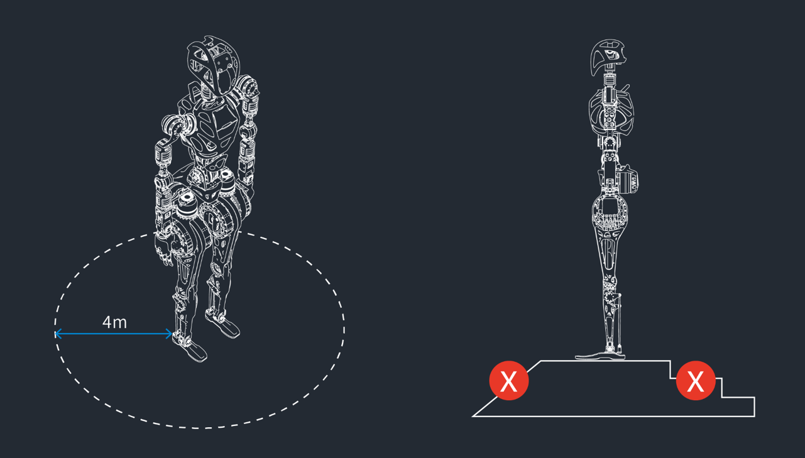
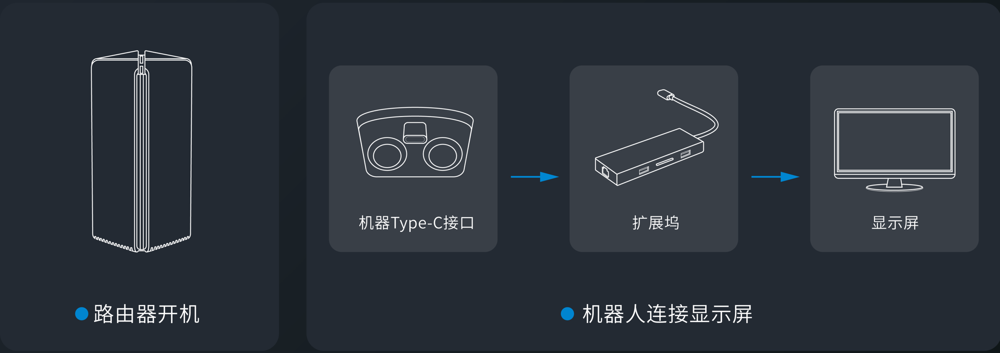
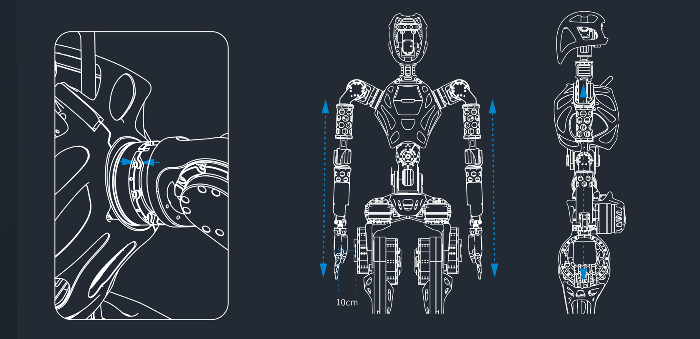
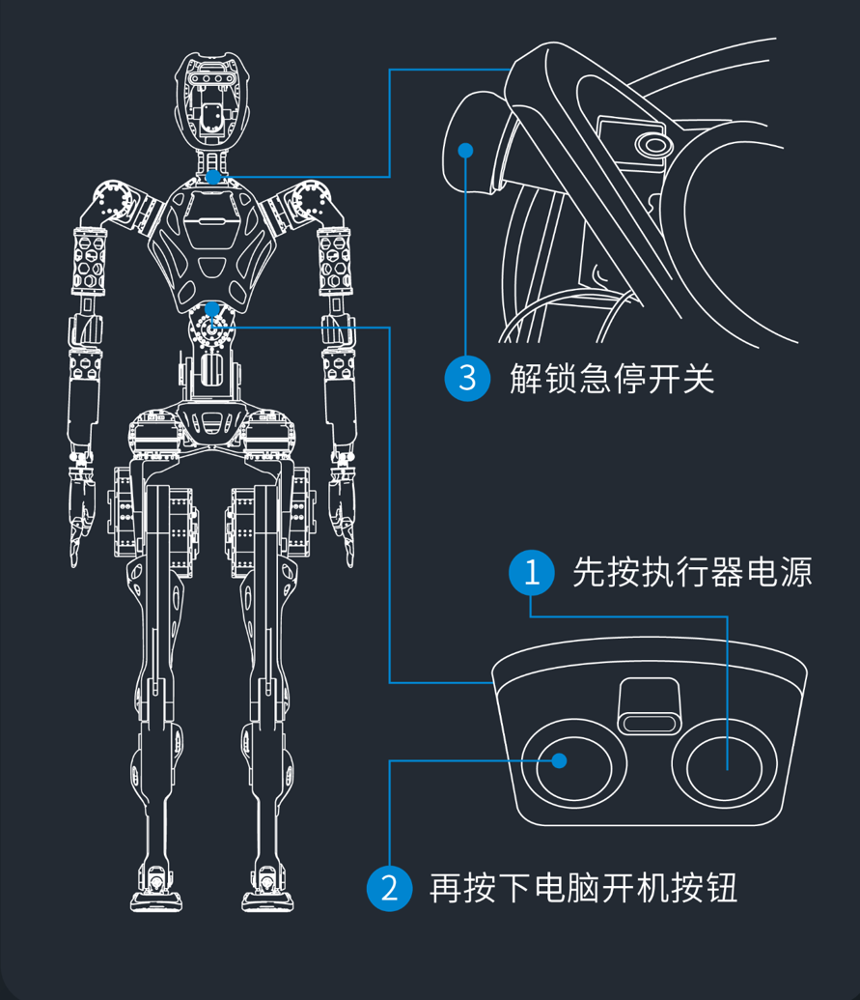
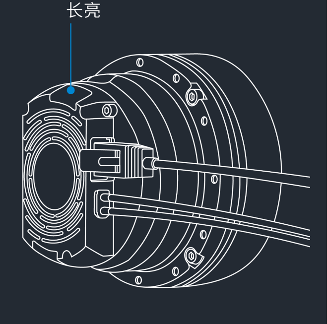
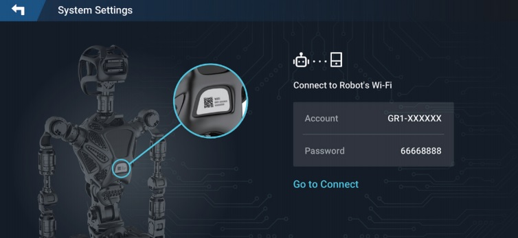
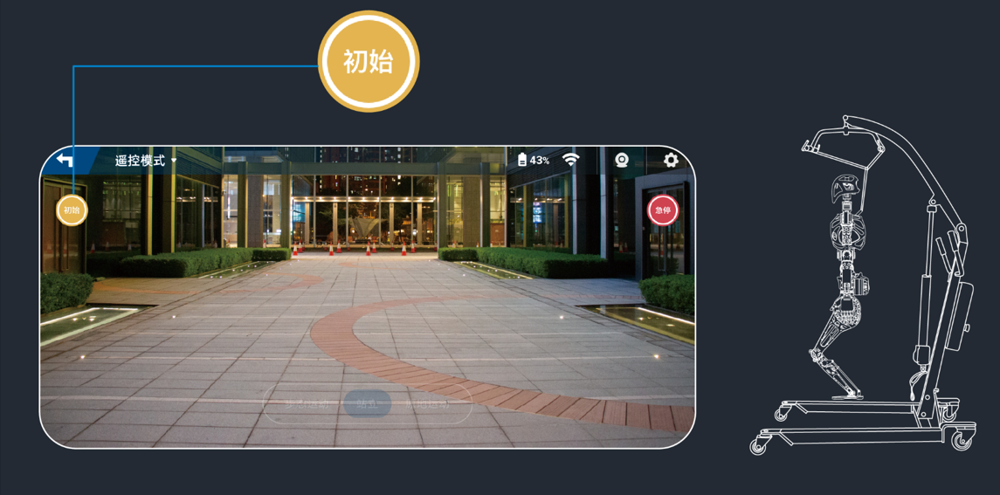
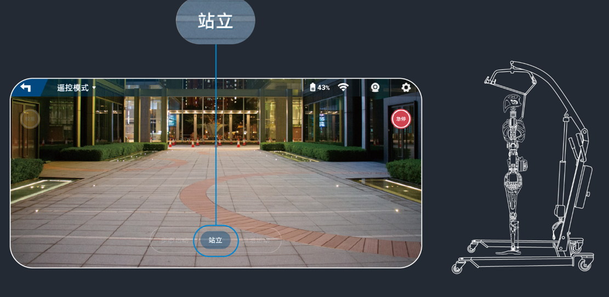
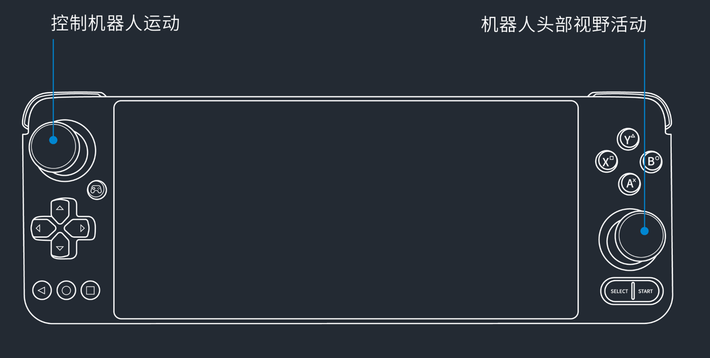

# About GR-1

The Fourier GR-1 represents a versatile humanoid robot, boasting a configuration of up to 40 FSA joints capable of delivering peak joint torque of 230 N.m. Its advanced whole-body control algorithm empowers the robot with an impressive 44 degrees of freedom.

This robotic marvel exhibits remarkable human-like agility and motion kinematics, including the ability to perform tasks such as:

* Straight leg walking
* High-speed walking
* Agile obstacle avoidance
* Graceful slope ascension and descension
* Robust response to impacts
* Seamless human-robot collaboration in task execution.

These capabilities position the Fourier GR-1 as a promising platform for the future of "Embodied AI." This next-generation concept aims to merge AI technology with physical robots, creating entities that are not only controllable and perceptive but also interactive and mobile.

The Fourier GR-1's scalability lends itself to the validation of various AI models and algorithms, opening up exciting possibilities for applications in industries, rehabilitation, household, and research.

# GR-1 Specifications

## Mechanical

| Items         | Value                                |
| :------------ | :----------------------------------- |
| Standing size | 1650 x 515 x 320 mm                  |
| Arm span      | 1680 mm                              |
| Net weight    | ≈ 55 kg                              |
| Materials     | Aluminum alloy, engineering plastics |

## Electrical

| Items                | Value  |
| :------------------- | :----- |
| Power supply voltage | 46.2 V |
| Max.  power          |        |

## Performance

| Items                    | Value                                |
| :----------------------- | :----------------------------------- |
| Walk speed               | 5 km/h                               |
| Single hand payload      | ≈ 3 kg                               |
| Basic computing capacity | 7-13700h 6P+8E 20 threads 1.6/5.0GHz |

## Joints

| Items                 | Value                                           |
| :-------------------- | :---------------------------------------------- |
| Total joint actuators | 44                                              |
| FSA actuators         | 32                                              |
| Max. joint torque     | 230 N.m                                         |
| Operating voltage     | 12 - 60 V                                       |
| Rated voltage         | 46 V                                            |
| Max. current          | 40 A                                            |
| Compliance standards  | GB 17625.1-2012，GB 4943.1-2011，GB/T 9254-2008 |

## Sensor

| Items        | Value     |
| :----------- | :-------- |
| Depth camera | Realsense |
| IMU          | √         |

## Battery and adapter

| Items                   | Value              |
| :---------------------- | :----------------- |
| Battery capacity        | 483 Wh             |
| Battery type            | Lithium battery    |
| Battery nominal voltage | 40 V               |
| Charging limit voltage  | 46 V               |
| Rated capacity          | 5.2Ah 112.3Wh      |
| Cruise duration         | ≈ 60 min           |
| Walk cruise duration    | ≈ 45 min           |
| Full charge             | 315 min            |
| Adapter input           | 100-240 V, 50/60Hz |
| Adapter output          | MAX. 46 V, 2 A     |

## Operating system and connection

| Items               | Value                                                                 |
| ------------------- | --------------------------------------------------------------------- |
| OS                  | Ubuntu18.04+ROS 2                                                     |
| External interfaces | HDMIx1，Type-C x 3(fast charge，USB，peripheral extension ports)      |
| Wireless connection | Wi-Fi，EEE 80211a/b/g/n/ac, bluetooth 4.2                             |
| Host                | ASUS 13th Generation - Dawn X MINI Commercial and Home Office Desktop |
| Model               | PN64171RZ                                                             |
| CPU                 | I7 13700H                                                             |
| Memory              | 16 G                                                                  |
| SSD                 | 512 G                                                                 |


# Operation Instruction

## Before power-on

Do the following steps before powering on the robot:

### Inspecting robot

1. Ensure that the robot is fastened to the support stand.
2. Ensure that the batteries of robot and the support stand are fully chareged.
3. Ensure that the robot components moves smoothly.


### Inspecting environment

1. Ensure that there is a 4-meter clearance around the robot.
2. Ensure that the ground is level and dry.



### Connecting robot to monitor

1. Power on the router.
2. Connect monitor to Type-C interface through the extension dock.



### Preparing arms for calibration

1. Align shoulder grooves.
2. Keep the arms hanging straight down with the palms facing inward.
3. Ensure a 10 cm interval between palms and hips.
4. Ensure that the robot stands upright.



## Powering on Robot

1. Press actuator power-on button.
2. Press robot host power-on button.
3. Release e-stop switch.

   
4. Initialize robot arms and legs through desktop terminal.

   Enter the following command to calibrate arms.

   ```
   $sh arm .sh
   ```

   Enter the following command to calibrate legs.

   ```
   $sh leg.sh
   ```

!>The robot has started successfullly if the indicator lights of actuators and robot host flash regularly.

   

## Connecting Remote Controller to Robot

1. Switch on the remote controller and open the **System Settings** interface.
2. Input the Wi-Fi account and password specified on the back of the robot.



3. Click **Connect** .

!> A success prompt will be given when the connection succeeds.

## Landing Robot

1. Ensure that the robot is fastened to the support stand.
2. Click **Initial** to make the robot to initial state.
   
3. Lower the robot with the lift of the support stand and ensure the robot's feet stably contact with the ground.
4. Click **Stand** in the remote controller.



## Controlling Robot

1. Power on the remote controller and connect to the robot's Wi-Fi.
2. Operate the remote controller to control the motion of the robot.

   Use left handler to move the robot.
   Use right handler to control the vision field.

   

## Pausing Robot Motion

Following two approaches are used to pause the motion of the robot:

* Press the **Stand** button on the remote controller.
* Press down the E-stop button in case of danger or any emergency situation.

 !>E-stop will cut off the power supply of the robot and risk of data loss.

## Powering off Robot

1. Fasten the robot to the supoort stand.
2. Press the E-stop button.
3. Press the actuator power button to power off the actuator.
4. Connect the robot to the monitor.
5. Kill the processes of the control software and then power off the robot host through the desktop terminal.
