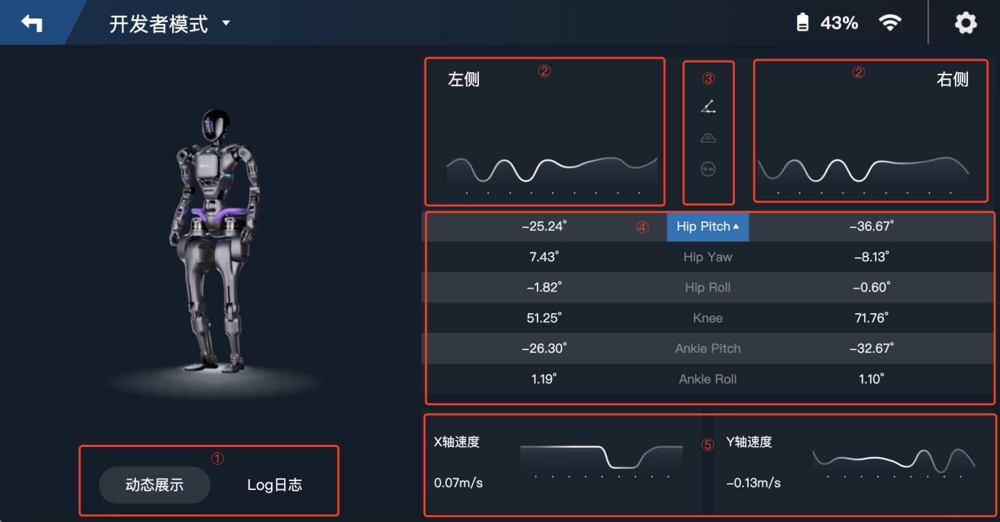
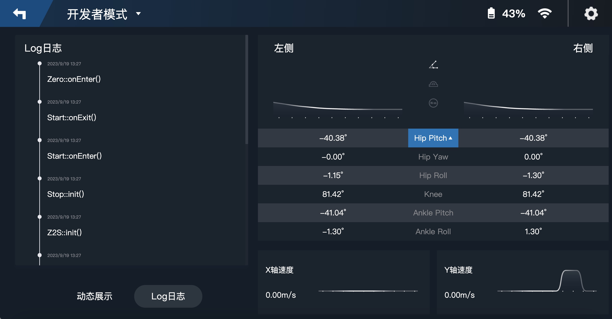
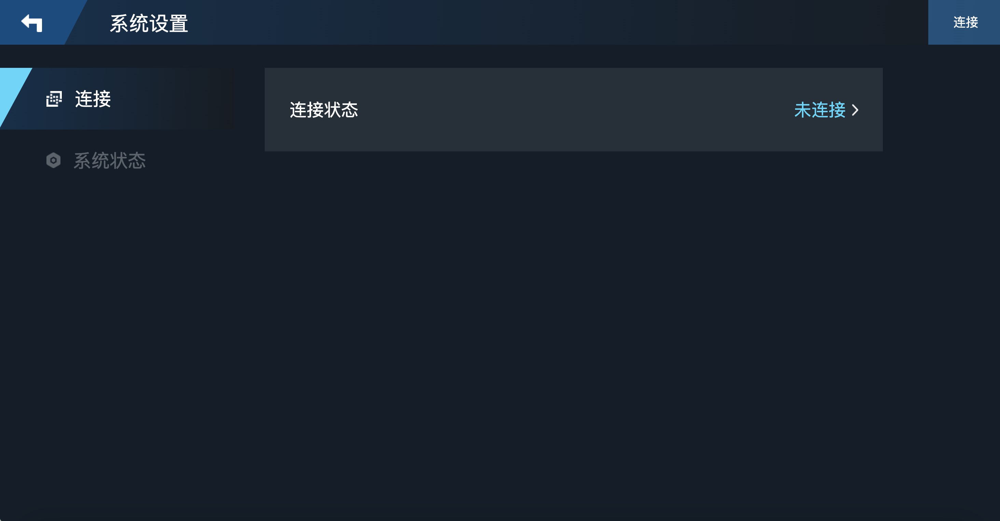
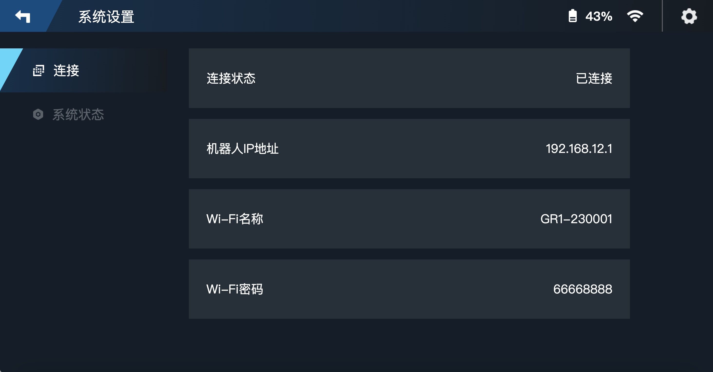
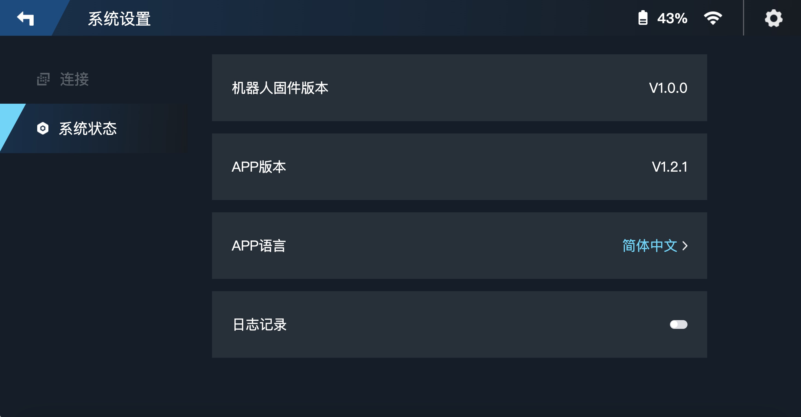
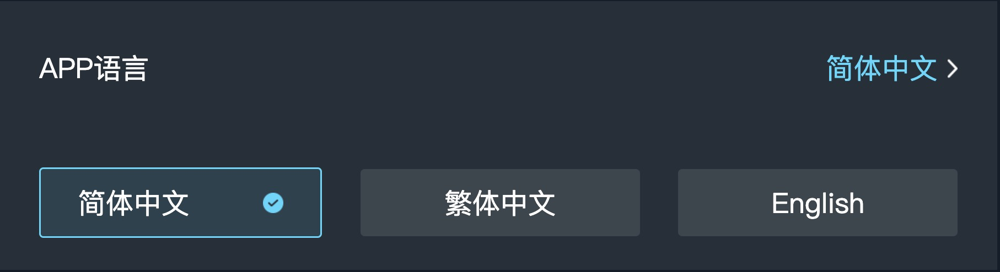

# 欢迎来到 GROS 控制端 App 使用说明

## 控制图解

### 1.开始界面



### 2.登陆界面--未连接

1. 进入连接页。
2. 开始探索--此时还是未连接状态，同样进入连接页。

### 3.设备连接

1. 机器人的 WiFi 信息通常可以在背后的标签处获得。若没有，可根据初始账号的提示找到对应前缀的 WiFi 名，初始密码一般为默认出厂时的统一密码。
2. 去连接-->弹出框提示默认在手机 WiFi 设置中自行连接。

### 4.登陆界面--已连接

1. 当人形机器人和 app 此时已连接状态时，显示当前机器人的电量，并且显示连接状态。
2. 开始探索--直接进入控制页。

### 5.加载界面

稍等几秒等待加载时间，进入后续操控页面。

### 6.控制界面(遥控模式)

1. 返回上级。
2. 切换当前模式，可由此进入开发者模式。

- 

3. 图传开关，是否开启或关闭实时图像。

- 
- 

4. 进入设置界面。
5. 校准-->向机器人发送归零(Zero)指令。
6. 急停-->向机器人发送急停(Stop)指令。
7. 切换速度档位，当前一共可切换 1 至 5 档。
8. 向机器人发送动作指令，分为步态运动，站立及原地运动。

- 
- 

9. 虚拟触控摇杆，左侧控制机器人前后行走及左右转向，右侧控制头部上下及左右移动。

### 7.开发者模式

1. 切换 Log 日志和动态展示。
2. 左右两侧实时数据折线图，每一秒更新一次，具体展示折线图的数据根据 ③ 和 ④ 进行切换显示。
3. 由上至下分别对应下表
   |属性|名称|单位|
   |---|---|---|
   |qa|角度|度|
   |qdota|速度|度/秒|
   |taua|扭矩|牛.米(N.m)|
4. 左右两侧实时关节数据表
   |属性|名称|
   |---|---|
   |Hip Pitch| 臀部俯仰角|
   |Hip Yaw| 臀部偏航角|
   |Hip Roll| 臀部翻滚角|
   |Knee| 膝盖俯仰角 |
   |Ankle Pitch| 踝关节俯仰角 |
   |Ankle Roll| 踝关节翻滚角 |
5. X 轴与 Y 轴速度实时数据折线图

### 8.系统设置

1. 连接(未连接)
   
2. 连接(已连接)
   
3. 系统状态
   
   在 APP 语言中，显示当前系统语言，并可从中切换至其他系统语言。
   
