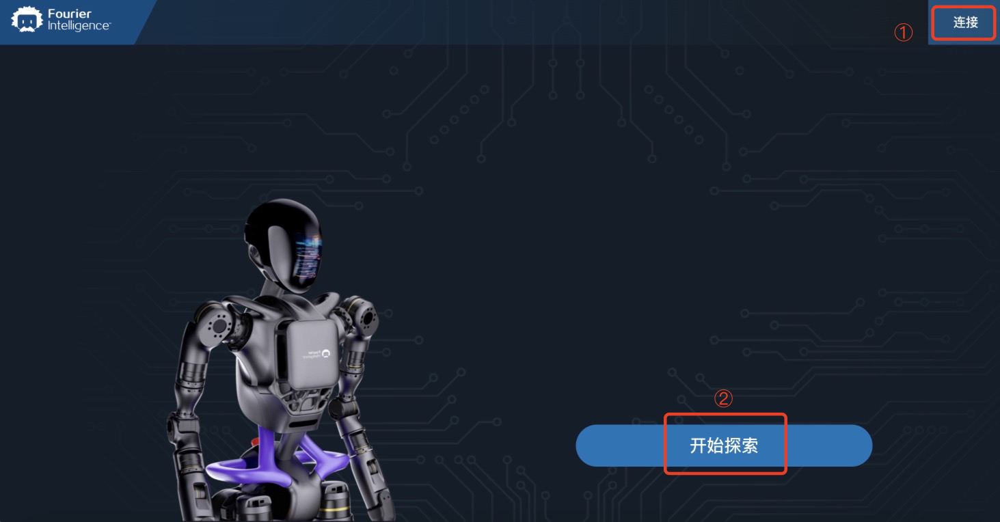
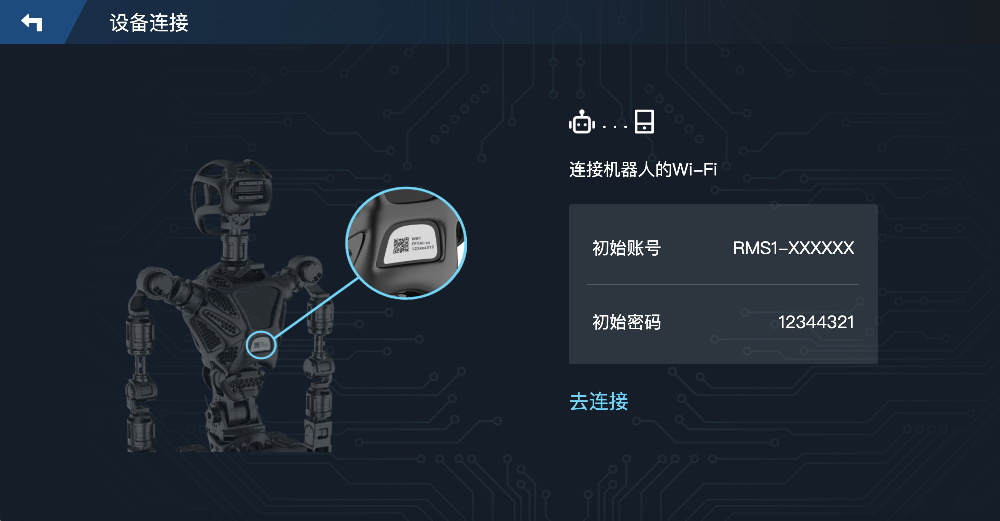
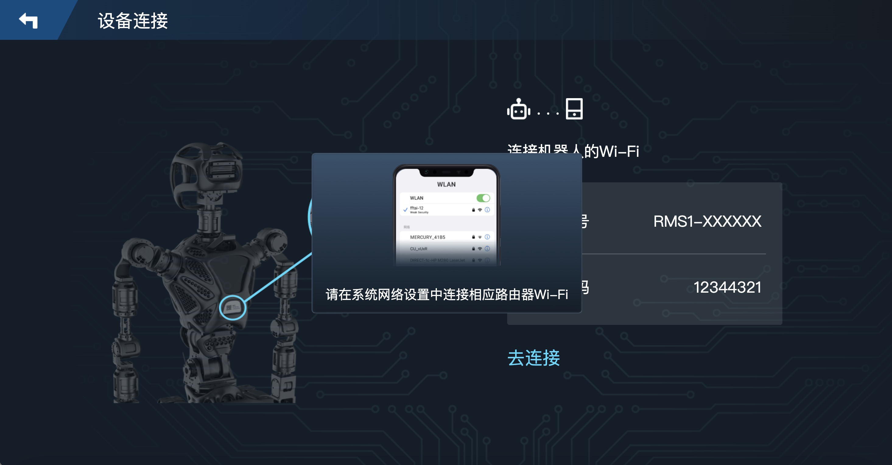
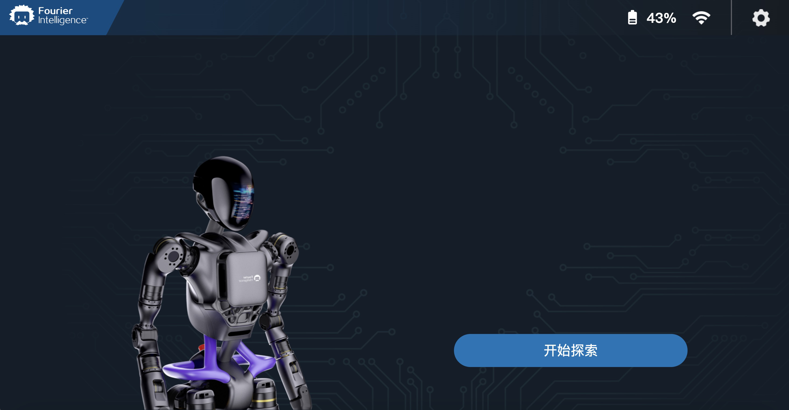
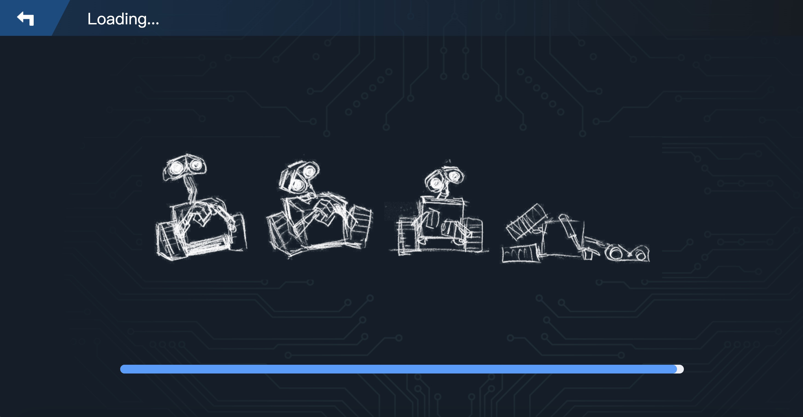
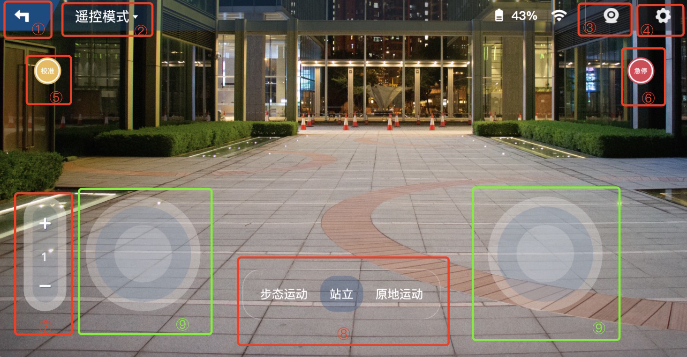
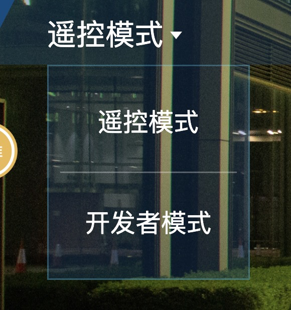
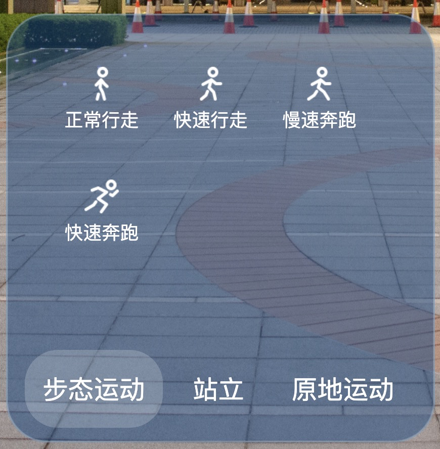
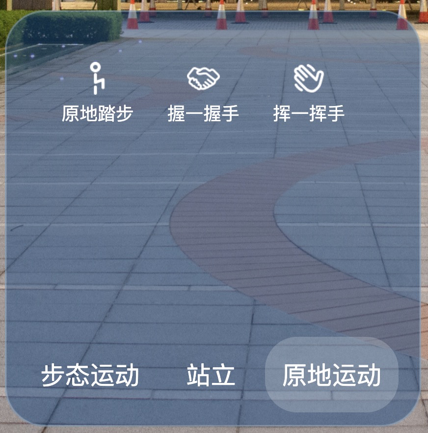

# 欢迎来到 GROS 控制端 App 使用说明

## 控制图解
### 1.开始界面



### 2.登陆界面--未连接

1. 进入连接页。
2. 开始探索--此时还是未连接状态，同样进入连接页。

### 3.设备连接

1. 机器人的WiFi信息通常可以在背后的标签处获得。若没有，可根据初始账号的提示找到对应前缀的WiFi名，初始密码一般为默认出厂时的统一密码。
2. 去连接-->弹出框提示默认在手机WiFi设置中自行连接。

### 4.登陆界面--已连接

1. 当人形机器人和app此时已连接状态时，显示当前机器人的电量，并且显示连接状态。
2. 开始探索--直接进入控制页。

### 5.加载界面

稍等几秒等待加载时间，进入后续操控页面。

### 6.控制界面

1. 返回上级。
2. 切换当前模式，可由此进入开发者模式。
- 
3. 图传开关，是否开启或关闭实时图像。
- 
- 
4. 进入设置界面。
5. 校准-->向机器人发送归零(Zero)指令。
6. 急停-->向机器人发送急停(Stop)指令。
7. 切换速度档位，当前一共可切换1至5档。
8. 向机器人发送动作指令，分为步态运动，站立及原地运动。
- 
- 
9. 虚拟触控摇杆，左侧控制机器人前后行走及左右转向，右侧控制头部上下及左右移动。