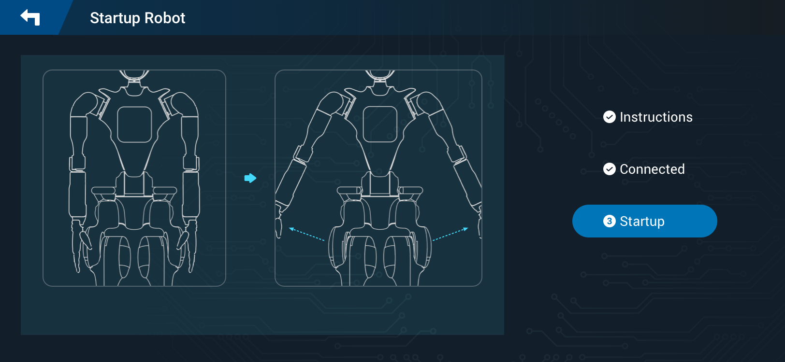
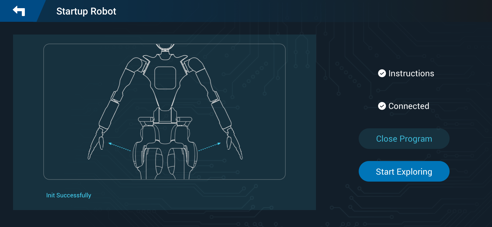
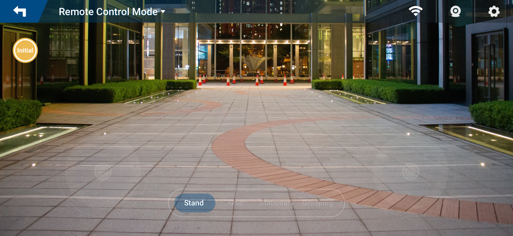

# Overview

This section is to guide you through the process of setting up and operating the Fourier Robot. Since the robot is delivered fully assembled, we will focus on the initial setup and basic operation.

Following topics are covered:

- [Overview](#overview)
- [Initial Setup and Powering on](#initial-setup-and-powering-on)
  - [Unpacking the Robot](#unpacking-the-robot)
  - [Charging](#charging)
  - [Preparation Before Power on](#preparation-before-power-on)
    - [Environmental Inspection](#environmental-inspection)
    - [Robot Inspection](#robot-inspection)
    - [Calibration Positioning](#calibration-positioning)
  - [Powering on Robot](#powering-on-robot)
  - [Connecting Control APP to Robot](#connecting-control-app-to-robot)
  - [Initiating Motion Control via Control APP](#initiating-motion-control-via-control-app)
  - [Setting Robot to Initial State](#setting-robot-to-initial-state)
  - [Landing Robot](#landing-robot)
- [Operations](#operations)
  - [Controlling Robot Movements](#controlling-robot-movements)
  - [Halting Robot Operations](#halting-robot-operations)
    - [Manual Interruption via Controller](#manual-interruption-via-controller)
    - [Emergency Shutdown](#emergency-shutdown)
  - [Powering off Robot](#powering-off-robot)

# Initial Setup and Powering on

## Unpacking the Robot

!> Due to the substantial weight and intricate design of the robot, it is crucial to engage at least two individuals in the unboxing process. This collaborative effort ensures safe and secure handling, minimizing the risk of potential damage caused by pinching or accidental dropping.

To begin, carefully follow these steps:

1. Begin by extracting the robot from its packaging box.
2. Verify the items against the provided packing list.

| Items              | Quantity | Comments                                   |
| :----------------- | :------- | ------------------------------------------ |
| **Standard Items** |          |                                            |
| Robot              | 1        |                                            |
| Power Adapter      | 1        |                                            |
| Remote Controller  | 1        |                                            |
| User Manual        | 1        |                                            |
| Certification      | 1        |                                            |
| Calibration Tools  | 15       |                                            |
| Extension Dock     | 1        |                                            |
| **Optional Items** |          |                                            |
| Protective Lift    | 1        | If required, kindly purchase it separately |

3. Remove protective coverings to prepare the robot for use.

## Charging

Before the initial use, it's essential to ensure that the robot, Remote Controller, and protective lift (if purchased) are fully charged using the provided chargers.

## Preparation Before Power on

### Environmental Inspection

The environment should meet the following criteria:

- The ground must be level and non-slippery to prevent accidental movements or falls.
- A minimum of 4 meters of free space around the robot is recommended to ensure a safe operating area and to accommodate the robot's range of motion.

### Robot Inspection

Prior to use, perform a comprehensive check of the robot:

- Ensure the robot is properly fastened to the protective lift.
- Inspect for any loose or damaged parts that could hinder the robot's smooth and unobstructed movement.
- Check that the robot's battery and the battery of any connected mobile devices have sufficient power for the operation.
- Remove the calibration pin, if present, to allow for proper movement.

### Calibration Positioning

Before activating the robot, it's critical to set it to its calibration pose. This includes:

1. Align shoulder slots.
2. Keep the arms hanging straight down with the palms facing inward.
3. Ensure a 10 cm interval between palms and hips.
4. Ensure that the robot bows down while keeping the waist upright, which facilitates a stable startup.

## Powering on Robot

1. Long press actuator power-on button.
2. Press embedded computer power-on button.
3. Release Emergence Stop switch.
4. Observe the robot's indicator light. A steady breathing blink pattern indicates that the robot is starting up normally.

!> The Emergency Stop switch should be released only after the calibration pose has been set. Once released, maintain the calibration pose for at least 5 seconds to ensure stability.

## Connecting Control APP to Robot

The robot creates a Wi-Fi hotspot that the Control APP needs to connect to for motion control. Once the connection is successful, the Control APP will indicate a `Connected` status.

For details, see [Connecting to Robot](demo_app/connnecting_to_robot).

## Initiating Motion Control via Control APP

To activate the motion control,

1. Click `Startup` in the Control APP interface. It prepares the hardware drive for operation.

   
2. Click `Start Exploring`. It enables the Control APP to manage the robot's movements.

   

## Setting Robot to Initial State

The initial state, which is a prerequisite for starting the motion control, ensures that the robot is in a defined and known position before beginning operations.

To set the robot to initial state:

1. Ensure that the robot is fastened to the protective lift.
2. Click `Initial` to make the robot to initial state in the Control APP interface.

   

!> Please be aware that the `Initial` button is intended for use exclusively when the robot is in an inactive state or standing posture and securely placed on the designated protective lift. This precaution is crucial to avoid potential mishaps and ensure accuracy during the initialization process. If the robot is engaged in any action other than standing, it must first return to a standing position before you initiate the `Initial` command.

## Landing Robot

This involves a series of actions to ensure the robot transitions safely from an inactive to an active state:

1. **Set Robot to Initial State** : As outlined in the preceding section.
2. **Control the Descent** : Use the protective lift descent button to control the robot's descent to the ground. This should be done slowly to prevent any impact or damage.
3. **Confirm Stability** : Once the robot has landed, gently shake it to confirm that it is stable and there are no issues with its balance or the surface it is on.
4. **Initiate Standing** : Click `Stand` to bring the robot to a standing position. During this process, you may need to assist the robot by adjusting its front-to-back center of gravity to achieve a stable upright position.
5. **Standing Assistance** : While the robot is standing, continue to assist by maintaining the correct balance until it can stand stably on its own. The blue area in the guidance indicates the location of the handrail to be used for this purpose.

# Operations

## Controlling Robot Movements

The robot features two primary operating modes: the remote control mode and the developer mode. It also offers an image transmission functionality, which users have the flexibility to switch on or off as needed during its operation. Moreover, the robot is designed with four motion modes, enabling it to carry out a diverse array of actions. These range from straightforward movements and interactions to complex tasks that demand precise motor skills.

To operate the robot:

1. Power on the remote controller and connect to the robot's Wi-Fi.
2. Operate the remote controller to control the motion of the robot.

   

For in-depth information regarding the operation of the robot, please refer to the section [Controlling Robot Movements](demo_app/control_robot_movements.md).

## Halting Robot Operations

There are two primary methods for stopping the robot's motion. Both are crucial for safeguarding the robot and its surroundings, providing a swift response in unforeseen circumstances or during standard operational pauses.

### Manual Interruption via Controller

- To momentarily pause the robot's activities, the `Stand` button on the Control APP interface should be pressed.
- Activating this button causes the robot to cease its current operation and, if it was standing, to maintain that posture. This approach offers a controlled means to momentarily halt the robot's actions without powering down the entire system.

### Emergency Shutdown

The Emergency Stop switch is employed under urgent conditions to immediately halt all robot operations, primarily for safety purposes. Such situations might include:

- Unusual or unexpected robot movements, like incorrect velocities or trajectories.
- When disassembly or maintenance is underway, necessitating a cessation of movement for safety.
- Occurrences of electrical issues, such as leaks, short circuits, or other malfunctions.
- Anticipation of potential hazards, for instance, if the robot is at risk of falling or posing an imminent danger to itself or the environment.

 !> Caution: Pressing Emergency Stop switch will cut off the power supply of robot and risk of data loss.

## Powering off Robot

To ensure the safe shutdown of the robot, follow these steps:

1. **Securing the Robot**: Before initiating the shutdown process, make sure the robot is secured to the protective lift. Ensure the robot is in a stable position and not in the middle of a task that requires completion.
2. **Return to Initial State**: Bring the robot back to its initial state. This step is crucial for ensuring that the robot is in a safe and neutral position, which prevents any issues when it is powered back on.
3. **Press Emergency Stop Switch**: Press the Emergency Stop switch as part of the shutdown process. This action ensures an immediate cessation of all operations and is a safety measure to prevent any unintended movements during the shutdown.
4. **Engage Power-Off Sequence** : Finally, activate the power-off sequence through the power off button on the right corner of the Control APP main interface.

!> Caution: Long pressing the embedded computer's power button for 15 seconds will forcibly shut down the robot. This function should primarily be used when the robot cannot be powered off normally. Please be aware that forcing a shutdown may potentially lead to robot file corruption, so perform this action with care.
