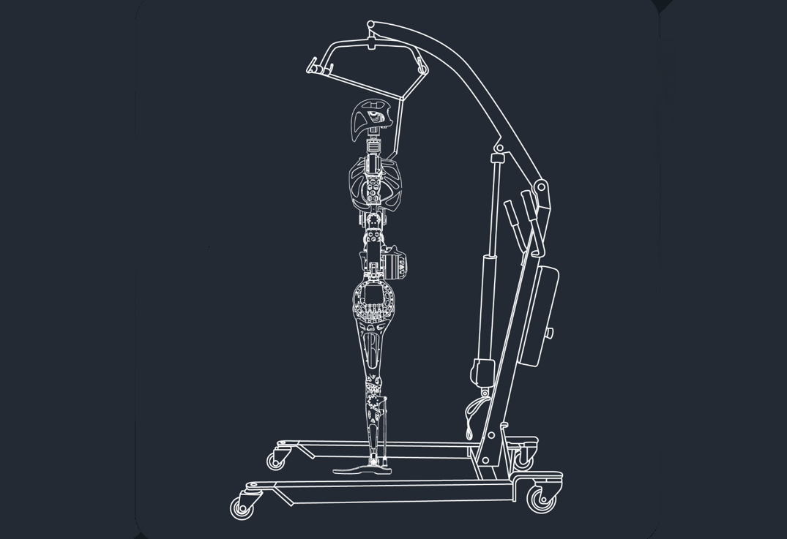
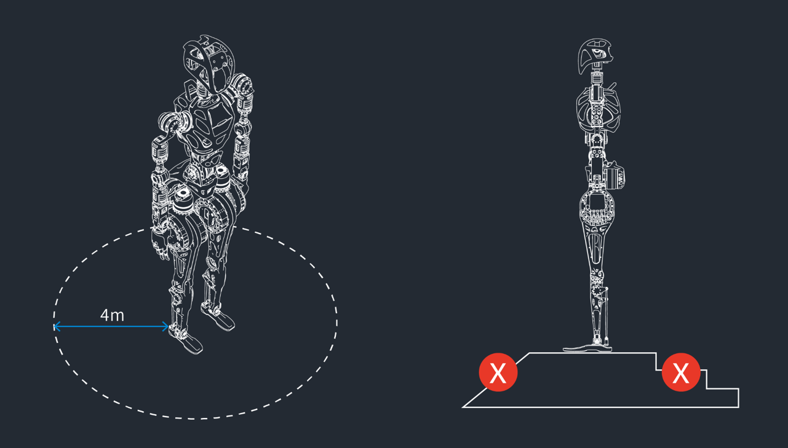
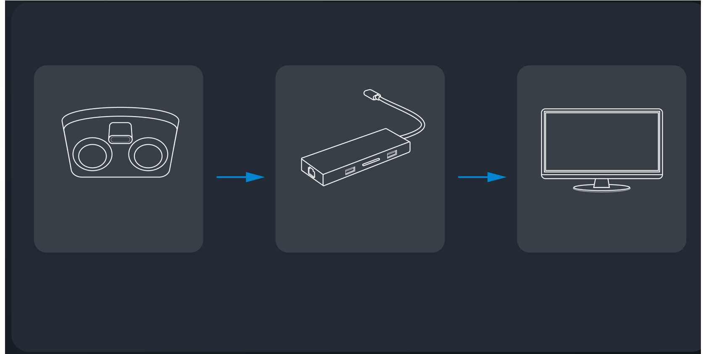
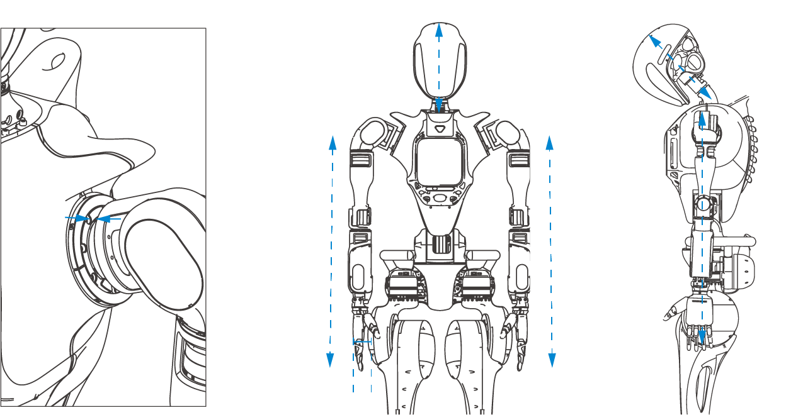
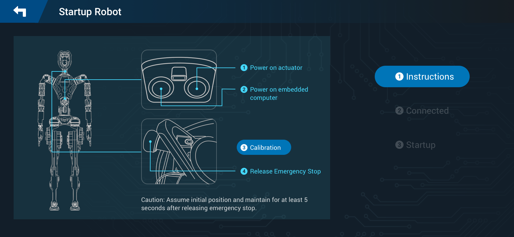
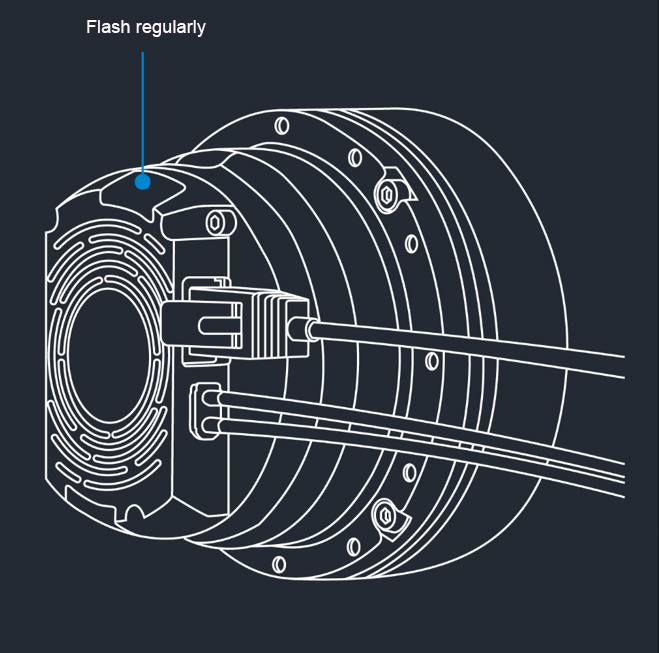
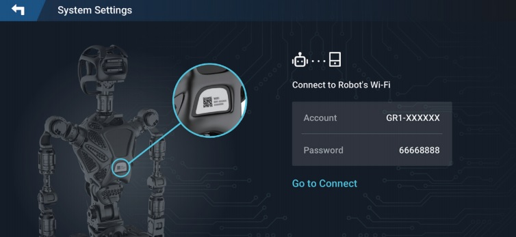
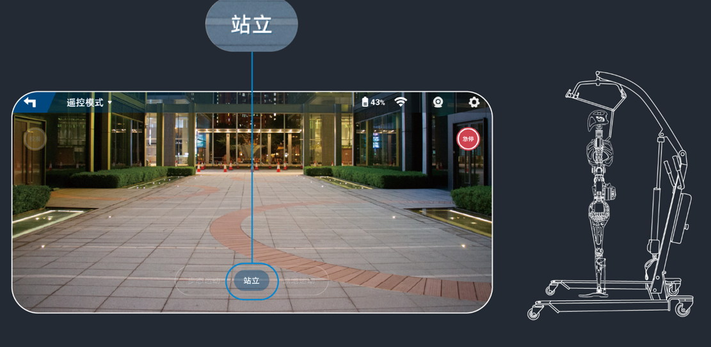
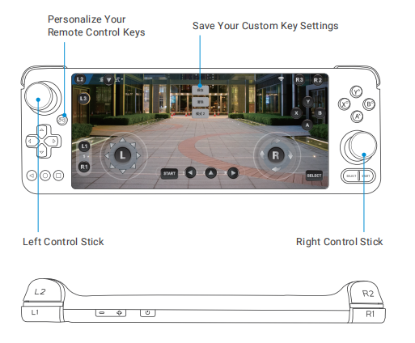

# Operation Instruction

This section is to guide you through the process of setting up and operating the Fourier Robot. Since the robot is delivered fully assembled, we will focus on the initial setup and basic operation.

## Initial Setup and Powering on

### Unpacking the Robot

!> Due to the substantial weight and intricate design of the robot, it is crucial to engage at least two individuals in the unboxing process. This collaborative effort ensures safe and secure handling, minimizing the risk of potential damage caused by pinching or accidental dropping.

To begin, carefully follow these steps:

1. Begin by extracting the robot from its packaging box.
2. Verify the items against the provided packing list.

| Items              | Quantity | Comments                                   |
| :----------------- | :------- | ------------------------------------------ |
| **Standard Items** |          |                                            |
| Robot              | 1        |                                            |
| Power Adapter      | 1        |                                            |
| Remote Controller  | 1        |                                            |
| User Manual        | 1        |                                            |
| Certification      | 1        |                                            |
| Calibration Tools  | 15       |                                            |
| Extension Dock     | 1        |                                            |
| **Optional Items** |          |                                            |
| Protective Lift    | 1        | If required, kindly purchase it separately |

3. Remove protective coverings to prepare the robot for use.

### Charging

Before the initial use, it's essential to ensure that the robot, Remote Controller, and protective lift (if purchased) are fully charged using the provided chargers.

### Inspecting Robot before Power-on

1. Ensure that the robot is fastened to the protective lift.
2. Ensure that the batteries of robot and the protective lift are fully charged.
3. Ensure that the robot components moves smoothly.

### Inspecting Environment before Power-on

1. Ensure that there is a 4-meter clearance around the robot.
2. Ensure that the ground is level and dry.

### Connecting robot to monitor

1. Power on the router.
2. Connect monitor to Type-C interface through the extension dock.

### Preparingfor Startup

1. Align shoulder slots.
2. Keep the arms hanging straight down with the palms facing inward.
3. Ensure a 10 cm interval between palms and hips.
4. Ensure that the robot stands upright.

## Starting up Robot

1. Press actuator power-on button.
2. Press embedded computer power-on button.
3. Release Emergence Stop switch.

!>The robot has started successfullly if the indicator lights of actuators and embedded robot computer flash regularly.

## Connecting Remote Controller to Robot

1. Switch on the remote controller and open the **System Settings** interface.
2. Input the Wi-Fi account and password specified on the back of the robot.

3. Click **Connect** .

!> A success prompt will be given when the connection succeeds.

## Landing Robot

1. Ensure that the robot is fastened to the protective lift.
2. Click **Initial** to make the robot to initial state.

3. Lower the robot with the lift of the protective lift and ensure the robot's feet stably contact with the ground.
4. Click **Stand** in the remote controller.

## Controlling Robot

1. Power on the remote controller and connect to the robot's Wi-Fi.
2. Operate the remote controller to control the motion of the robot.

   

## Halting Robot Motion

Following two approaches are used to halt the motion of the robot:

* Press the **Stand** button on the remote controller.
* Press down the E-stop button in case of danger or any emergency situation.

 !>E-stop will cut off the power supply of the robot and risk of data loss.

## Powering off Robot

1. Fasten the robot to the protective lift.
2. Press the E-stop button.
3. Press the actuator power button to power off the actuator.
4. Connect the robot to the monitor.
5. Kill the processes of the control software and then power off the robot host through the desktop terminal.
