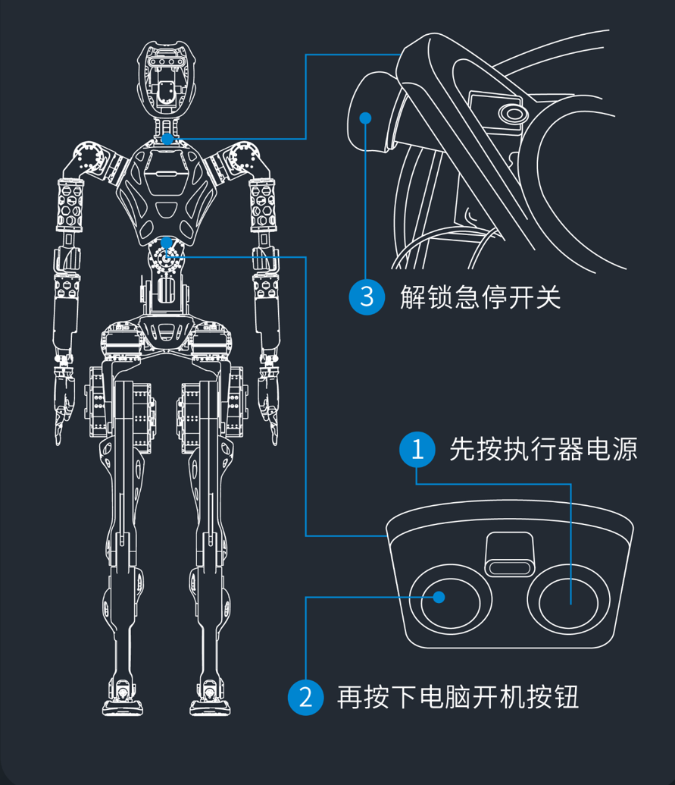
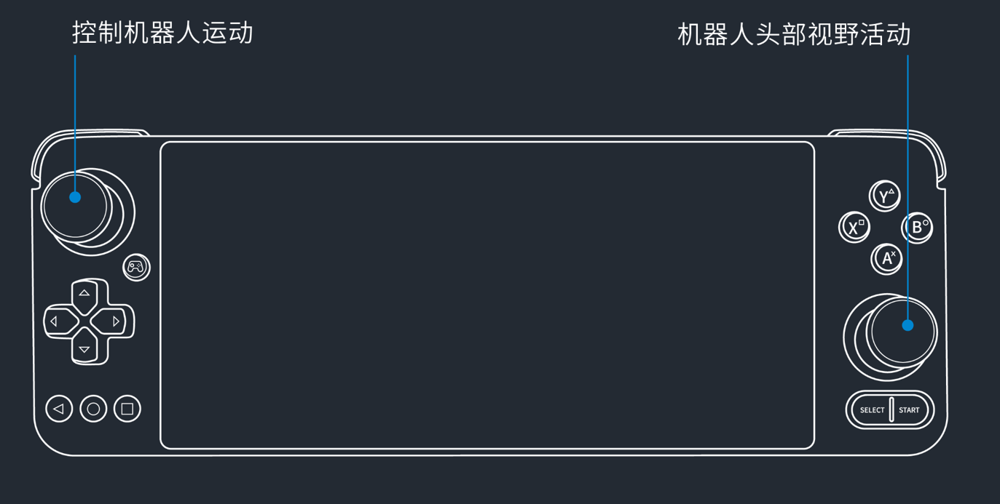

# Operation Instruction

## Before power-on

Do the following steps before powering on the robot:

### Inspecting robot

1. Ensure that the robot is fastened to the support stand.
2. Ensure that the batteries of robot and the support stand are fully chareged.
3. Ensure that the robot components moves smoothly.


### Inspecting environment

1. Ensure that there is a 4-meter clearance around the robot.
2. Ensure that the ground is level and dry.


### Connecting robot to monitor

1. Power on the router.
2. Connect monitor to Type-C interface through the extension dock.


### Preparing arms for calibration

1. Align shoulder grooves.
2. Keep the arms hanging straight down with the palms facing inward.
3. Ensure a 10 cm interval between palms and hips.
4. Ensure that the robot stands upright.


## Powering on Robot

1. Press actuator power-on button.
2. Press robot host power-on button.
3. Release e-stop switch.



4. Initialize robot arms and legs through desktop terminal.

   Enter the following command to calibrate arms.

   ```

   $sh arm .sh

   ```

   Enter the following command to calibrate legs.

   ```

   $sh leg.sh

   ```

!>The robot has started successfullly if the indicator lights of actuators and robot host flash regularly.


## Connecting Remote Controller to Robot

1. Switch on the remote controller and open the **System Settings** interface.
2. Input the Wi-Fi account and password specified on the back of the robot.


3. Click **Connect** .

!> A success prompt will be given when the connection succeeds.

## Landing Robot

1. Ensure that the robot is fastened to the support stand.
2. Click **Initial** to make the robot to initial state.


3. Lower the robot with the lift of the support stand and ensure the robot's feet stably contact with the ground.

4. Click **Stand** in the remote controller.


## Controlling Robot

1. Power on the remote controller and connect to the robot's Wi-Fi.
2. Operate the remote controller to control the motion of the robot.

   Use left handler to move the robot.

   Use right handler to control the vision field.



## Halting Robot Motion

Following two approaches are used to halt the motion of the robot:

* Press the **Stand** button on the remote controller.
* Press down the E-stop button in case of danger or any emergency situation.

 !>E-stop will cut off the power supply of the robot and risk of data loss.

## Powering off Robot

1. Fasten the robot to the supoort stand.
2. Press the E-stop button.
3. Press the actuator power button to power off the actuator.
4. Connect the robot to the monitor.
5. Kill the processes of the control software and then power off the robot host through the desktop terminal.
