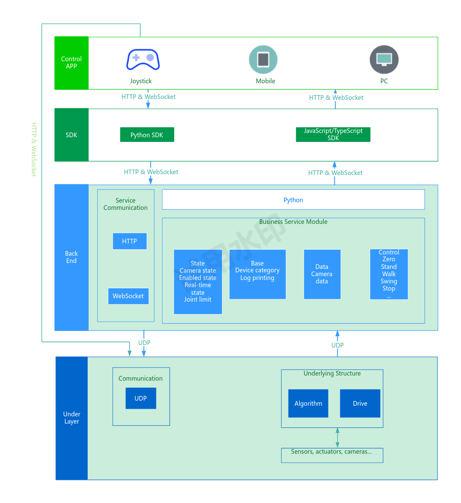

# Overview

The RoCS architecture presents a multi-layered, integrated framework for humanoid robot control. It combines intuitive user interfaces with powerful communication protocols and development tools, backed by a robust backend that translates human intentions into robotic actions. Through this architecture, the RoCS enables seamless human-robot interaction, fostering advancements in robotics and expanding the scope of what these incredible machines can achieve.

# Control App (User Interface) Layer

The UI layer is the user's gateway to the robot, consisting of various interfaces tailored to different control paradigms.

The Control App offers a graphical interface for direct manipulation and command input. It is designed with a focus on ease-of-use, providing a dashboard through which users can monitor robot status and issue commands with simple touch gestures.

* **Joystick**

For tasks requiring granular control, the joystick presents a tactile interface. It grants the operator precise control over the robot's movements, facilitating operations that demand high accuracy.

* **Mobile**

The mobile interface is geared towards accessibility and convenience. It enables operators to control the robot remotely through a smartphone or tablet, ensuring control is always at the user's fingertips.

* **PC**

The PC interface provides a robust control environment for complex task management. It supports extensive customization and is suited for users who require a comprehensive suite of control options.

# Communication Protocols

The system utilizes HTTP and WebSocket protocols to establish and maintain a reliable communication channel between the UI layer and the robot's core systems.

* **HTTP**

HTTP is utilized for transactional interactions, such as sending specific commands that require acknowledgment before the next action is taken.

* **WebSocket**

WebSocket facilitates a persistent, real-time communication stream, allowing for continuous data flow and immediate command execution, essential for responsive robot control.

# Software Development Kits (SDKs)

SDKs empower developers to extend the system's capabilities by building custom applications or integrating additional functionalities.

* **Python SDK**

The Python SDK is leveraged for its simplicity and the extensive support it offers for automation and data processing, making it ideal for scripting robot behaviors and processing sensor data.

* **JavaScript/TypeScript SDK**

The JavaScript/TypeScript SDK is used for developing web-based control interfaces, providing a seamless integration with the robot's backend systems and the user's browser.

# Backend Layer

This layer is the RoCS's operational core, housing the service communication and business logic modules.

## **Service Communication**

This component is responsible for the dispatch and coordination of commands, ensuring that instructions from the UI are correctly interpreted and executed by the robot.

## **Business Service Module**

It embodies the control logic, translating user commands into actionable tasks that the robot can perform. It also processes input from the robot's array of sensors to inform its actions and responses.

* **State Management:** Manages diverse states including camera status, robot activation, real-time updates, and joint limit information.
* **Base Service:** Incorporates essential services like device categorization and logging functionalities.
* **Data Service:** Manages the flow of data, especially from cameras, ensuring efficient data handling.
* **Motion Control:** Encompasses a spectrum of motion commands, from fundamental actions like returning to zero position to complex maneuvers like walking, swinging, and stopping.

# Under Layer Communication

Employing UDP protocol, the under layer communication ensures swift and efficient transmission of low-level commands to the robot's actuators and motors.

## Underlying Structure

The underlying structure encompasses the algorithms and drive systems that actualize the robot's movements. At the foundation of the architecture, the underlayer orchestrates the intricate dance of hardware, sensors, actuators, and algorithmic processes.
