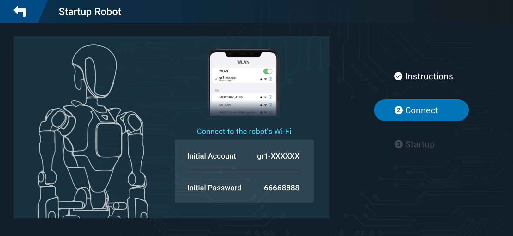

# Connecting to Robot

To control the robot using the RoCS Control App, you need to establish a connection between the app and the robot. This section provides guidelines on how to connect to the robot based on your chosen method.

## Connection Methods

The RoCS Control App supports various methods for connecting to the robot. Choose the method that best suits your requirements:

### Wi-Fi Connection

#### Robot's Wi-Fi Hotspot

If you are using the Remote Controller, follow these steps:

1. Power on the Remote Controller and the RoCS Control App is launched automatically.
2. On the app interface, click on the `Connect` button in the right corner (if not connected). You will be guided to the Start Robot process.
   
3. Finish the powering on step according to the on-screen instructions.
   The robot's Wi-Fi hotspot functionality is enabled automatically during the booting of the embedded computer.

   
4. Click on `Device Connection` (Step 2) of the Start Robot workflow. This will lead you to the `System Setting` -> `Networking Setting` of your mobile device, where you can choose the robot's Wi-Fi hotspot (Default account: gr1-XXXXXX, Default password: 66668888).

   

#### General Wi-Fi Connection

To establish a general Wi-Fi connection, it's necessary to manually assign the IP address of the embedded robot computer to the Control APP. Follow these steps for configuration:

1. **Determine the IP Address of the Embedded Robot Computer** :

* Connect a monitor to the embedded robot computer.

* Open a terminal and execute the command `ifconfig`. This will display the IP address of the embedded robot computer.

2. **Configure the Control APP** :

* On your desktop, launch HBuilderX and open the `.env.production` file.
* Set the `VUE_APP_URL` value to the IP address of the embedded robot computer. For instance, `VUE_APP_URL="http://192.168.8.37:8001"`.
* Go to `Build -> Mobile APP-Cloud Packaging` to initiate the APK building process.

3. **Install the New APK on the Remote Controller** :

* Connect the Remote Controller to your desktop using a USB cable.
* In HBuilderX, right-click the newly created APK and select `Install to phone`.

4. **Establish Connection to the Robot** :

* Launch the Control APP on the Remote Controller.
* The app should automatically connect to the robot.

!> Construct the APK using your selected version of the Control APP source code, available at the [RoCS App Repository](https://github.com/FFTAI/rocs_app).

## Verification

After establishing the connection, it's essential to verify that the RoCS Control App has successfully connected to the robot. Follow these steps for verification:

1. Return to Control App.
2. Check connection Status:

   * Check that the "Connected" step is shown in the Start Robot workflow, indicating that the APP is successfully connected to robot.

     

## Troubleshooting

If you encounter any issues during the verification process, consider the following troubleshooting steps:

* Ensure that the Wi-Fi connection details, including the Default account (gr1-XXXXXX) and default password (66668888), are correctly entered.
* Check the robot's Wi-Fi hotspot settings to confirm that it is active and available.
* Restart both the RoCS Control App and the robot, then attempt the connection process again.

Remember to adhere to safety guidelines and recommendations throughout the verification process.
