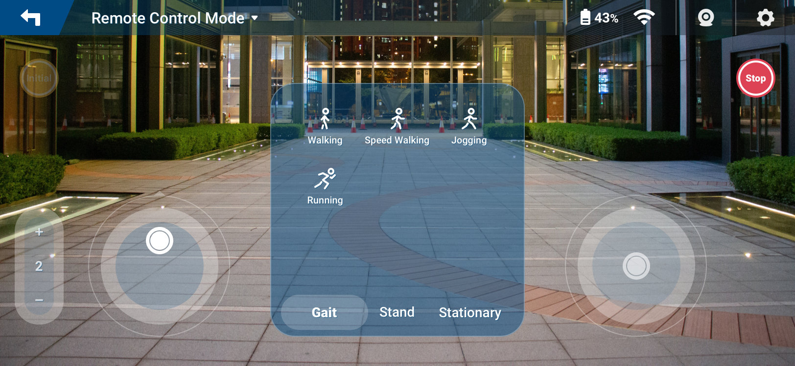
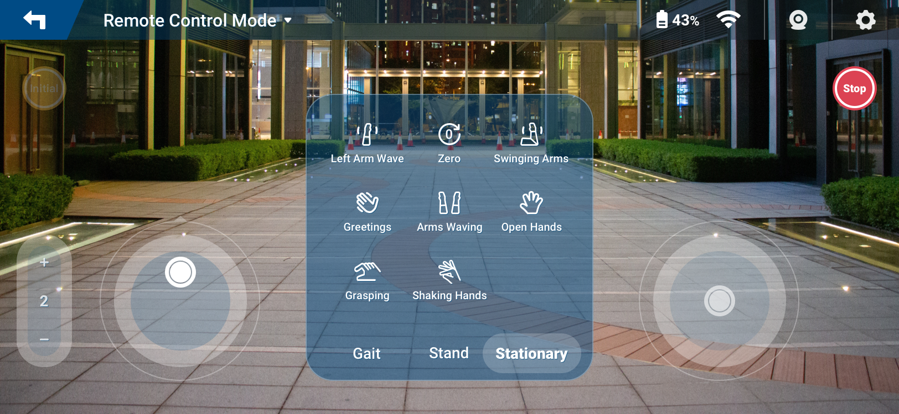
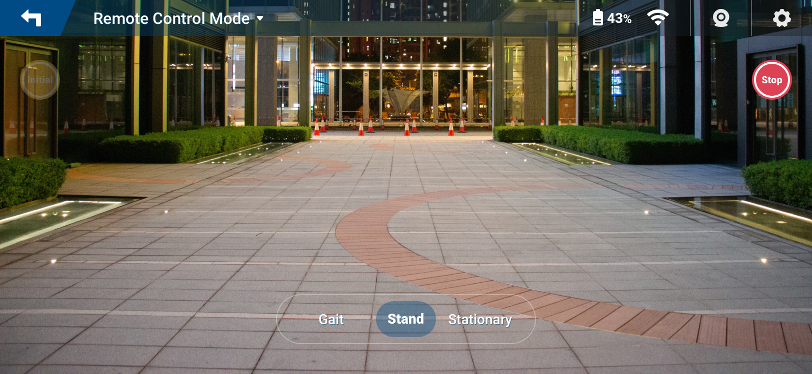
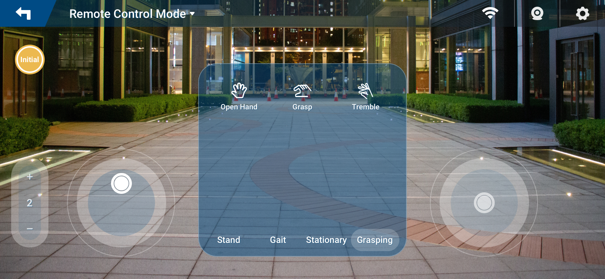

# Controlling Robot Movements

The RoCS Control App provides users with intuitive controls to command various movements of the robot, allowing for a dynamic and interactive experience.

Following topics are covered:

- [Controlling Robot Movements](#controlling-robot-movements)
  - [Gait Motion](#gait-motion)
  - [Stationary Motion](#stationary-motion)
  - [Stand Motion](#stand-motion)
  - [Grasping Motion](#end-effector-motion)

## Gait Motion

In Gait Motion Mode, users can command the robot to move in different directions, including forward, backward, left, and right. This mode offers a dynamic and directional approach, enabling users to navigate the robot seamlessly.

To control the robot in Gait Motion Mode:

1. Click `Start Exploring` in the Remote Control APP.
2. Choose the Gait motion mode.

   
3. Use the intuitive controls, such as a joystick or touchscreen, to direct the robot's movements.
4. Experiment with variations in speed and direction to suit specific scenarios.

## Stationary Motion

Stationary Motion Mode provides control over the robot's movements while it remains in a fixed position. This mode is ideal for showcasing dynamic actions without changing the robot's location.

To control the robot in Stationary Motion Mode:

1. Click `Start Exploring` in the Remote Control APP..
2. Select Stationary motion mode.

   
3. Utilize the controls to prompt on-the-spot movements, allowing for dynamic action demonstrations.

## Stand Motion

In Stand Mode, the robot maintains a static standing posture, suitable for scenarios requiring a stationary robot presence. This mode is useful for applications where a consistent and non-mobile robot presence is needed.

To engage the robot in Stand Mode:

1. Click `Start Exploring` in the Remote Control APP.
2. Choose Stand motion mode.

   
3. The robot will maintain a static standing position until instructed otherwise.

!> Avoid keeping robot in the stand position for an extended period, as it can cause damage to ankle actuators due to overloading.

## Grasping Motion

Grasping motion mode introduces a specialized mode for controlling the robot's end effector grasping actions. This mode is designed for tasks involving object manipulation, adding a unique capability to the robot.

To control the robot in Grasping motion mode:

1. Click `Start Exploring` in the Remote Control APP.
2. Select Grasping motion mode.

   
3. Use the controls to command the robot's end effector, allowing for precise grasping actions.

Understanding these distinct motion modes empowers users to command the robot effectively, whether it's navigating a space, demonstrating actions, maintaining a static posture, or engaging in intricate object manipulation tasks. Experimenting with different modes and controls enhances the user experience, offering versatility in robotic interactions.
