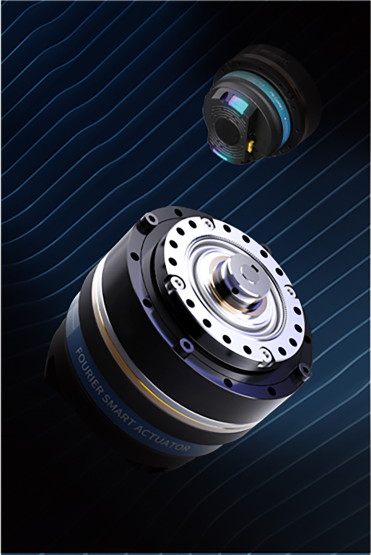
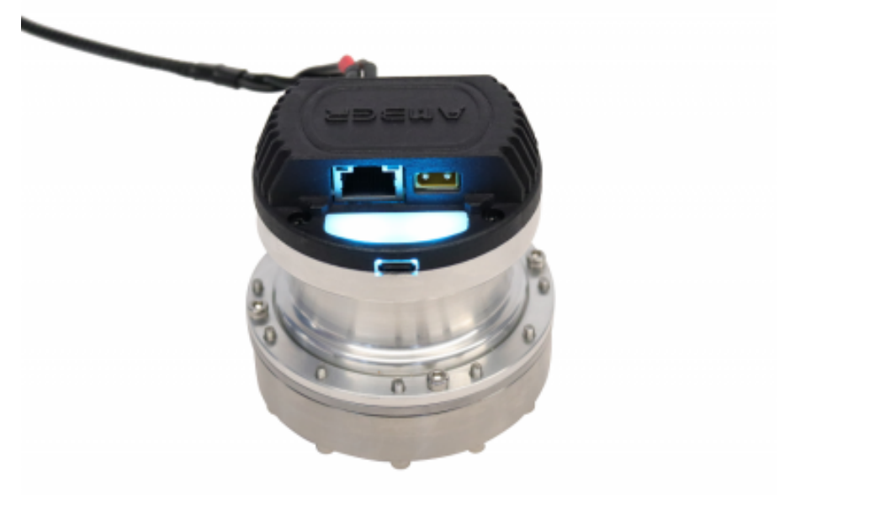

# About FSA

The Fourier Smart Actuator (FSA) is an advanced mechanical component seamlessly integrating into robotic systems. Serving as an integrated actuator, it combines the power sources of robots—such as reduction gearboxes, electric motors, and drivers—into a unified and compact mechanism. This design ensures a streamlined and efficient structure. The FSA introduces smart features that enhance its capability to precisely control and optimize various robotic actions.

The actuator's integration of power elements contributes to its adaptability and performance, making it an innovative and efficient solution for a range of robotic applications.



## Motor Output

| Motor Parameters        | Value       | Electronics        | Value          |
| :---------------------- | :---------- | ------------------ | -------------- |
| Type                    | BLDC        | Rated Voltage      | 48 VDC         |
| Output Mechanical Power | 184.7 W     | Rated Current      | 4.7 A          |
| Rated Speed             | 3000 RPM    | Encoder Resolution | 4000 Step/turn |
| No load Speed           | 4800 RPM    | Wires              | GH1.25 4pin    |
| Rated Torque            | 0.58 Nm     | Power Adaptor      | XT30           |
| Peak Torque             | 1.74 Nm     | Protocol           | Ethernet UDP   |
| Torque Constant         | 0.09 Nm/A   | Volltage Range     | 2 VDC ~ 48 VDC |
| Max Phase Current       | 6.647 A     |                    |                |
| Temperature Range       | -10℃ ~ +50℃ |                    |                |

## Actuator Performance (Output)

| Type                 | Reduction Ratio | Rated Torque/ Nm | Max Torque/Nm | Rated Speed/ RPM | Max Speed/ RPM |
| :------------------- | :-------------- | ---------------- | ------------- | ---------------- | -------------- |
| AIOS-Pro-MO60-90-30  | 30              | 17.4             | 52.2          | 100              | 160            |
| AIOS-Pro-MO60-90-50  | 50              | 29               | 87            | 60               | 96             |
| AIOS-Pro-MO60-90-80  | 80              | 46.4             | 139.2         | 37.5             | 60             |
| AIOS-Pro-MO60-90-100 | 100             | 58               | 174           | 30               | 48             |
| AIOS-Pro-MO60-90-120 | 120             | 69.6             | 208.8         | 25               | 40             |

## Interfaces

| Items                          | Value                |
| :----------------------------- | :------------------- |
| Physical layer                 | 10/100 Mbps Ethernet |
| Transport protocol             | UDP                  |
| Communication port (real-time) | 8080                 |
| Communication port (service)   | 25001                |
| IP acquisition method          | DHCP                 |
| Data exchange format           | JSON                 |

## Diagram


# Connecting FSA to Robot System

Connecting the FSA to a robot is a simple process requiring only a power cable and a network cable.

## Connecting Power Cable

In the process of connecting the power cable, it's essential to note that the cable is equipped with a specialized aviation connector, featuring both positive (+) and negative (-) terminals. Refer to the following image for a visual guide on properly attaching the aviation connector to the corresponding ports.



## Connecting FSA to Network

### Wired Connection

Connecting an actuator typically involves one or two network ports, with one of them linked to the Raspberry Pi via an Ethernet cable. If the actuator is equipped with dual network ports, these can be used for cascading multiple actuators. Once the Ethernet cable is properly connected, power up the Raspberry Pi (ensuring the system has fully started) and then power up the actuator. When the actuator's signal light initiates a rapid purple breathing blink, it indicates an ongoing wired network connection. Upon successful connection, the signal light transitions to a slow purple blink. If IP allocation fails after 10 seconds, the actuator will attempt a wireless network connection, and the blinking color will change from rapid purple to rapid blue.

!> Typically, the initial connection may fail. In such cases, it is recommended to power cycle the actuator. After a restart, the actuator should reliably establish a wired network connection.

### Wireless Connection

The wireless network's SSID and password must be configured through a Python script while connected via a wired connection. Begin by connecting the actuator to the Raspberry Pi using a wired connection. Once the actuator obtains an IP address,

1. Run command `nano network_setting.py` to set the network parameters in the python file.

```python
# Set network parameters
for i in range(len(Server_IP_list)):
    network_params = {
        'DHCP_enable': True,
        'SSID': 'wifi-name',
        'password': 'wifi-password',
        'staticIP': [192, 168, 100, i + 10],
        'gateway': [192, 168, 100, 1],
        'subnet': [255, 255, 255, 0],
        'dns_1': [114, 114, 114, 114],
        'dns_2': [8, 8, 8, 8]
    }

```

2. Save the python file and run `python3 network_setting.py`.

   Upon successful execution, it will return a confirmation message.

   ```
   Send JSON Obj: {"method": "SET", "reqTarget": "/network_setting",
   "DHCP_enable": true, "SSID": "wifi-name", "password": "wifi-password"}Server received from ('10.0.0.17',
    2334):{"status":"OK","reqTarget":"/network_setting"}
   ```

 !> At this point, the Wi-Fi configuration for the actuator is successfully set. Disconnect the Ethernet cable, power cycle the actuator, and after 10 seconds, observe the signal light transitioning from a rapid purple blink to a rapid blue blink. Once the connection is established, the signal light will shift to a slow blue blink, indicating a successful connection to the wireless network.

### Indicators

The indicator lights convey important information through various blinking modes. Here's a breakdown of their meanings:

| Mode                            | Meaning                                |
| ------------------------------- | -------------------------------------- |
| Fast Purple Breathing Blink     | Wired Ethernet connection in progress  |
| Slow Purple Breathing Blink     | Wired Ethernet connection successful   |
| Fast Cyan-Blue Breathing Blink  | Wi-Fi connection in progress           |
| Slow Cyan-Blue Breathing Blink  | Wi-Fi connection successful            |
| Fast Red Breathing Blink        | Actuator error                         |
| Fast Jade Green Breathing Blink | OTA (Over-The-Air) upgrade in progress |
| Fast Orange Breathing Blink     | Searching for actuator                 |
