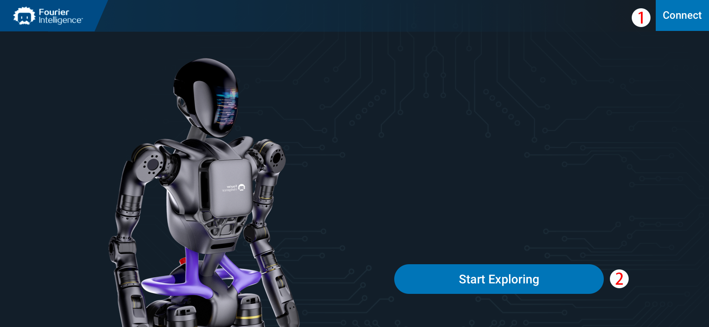
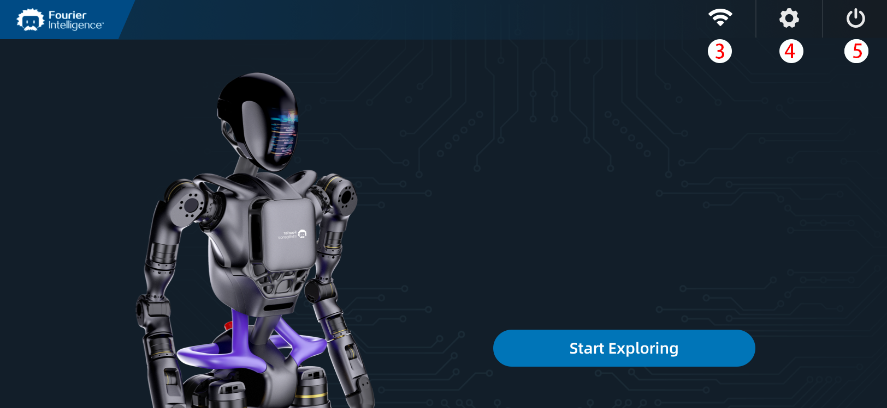

# Login Interface

The login interface is designed to provide users with a seamless login experience. It comprises various elements, including a header, an image of GR-1 robot, a `Start Exploring` button, and a prompt box appearing based on certain user interactions. The functionality is implemented using the Vue.js framework with Vuex for state management.

### **Disconnected**

### **Connected**

### Header

The header component serves as the top section of the login interface. It includes a logo and login-related functionality.

* **Events:**

  * `@connect`: Triggered when the `Connect`button is clicked. It invokes the `startExplore()` method.
  * `@shutDown`: Triggered when the `Shutdown`button is clicked. It opens the prompt box via the `promptBoxOpen()` method.

### `Start Exploring` Button

The `Start Exploring` button is a call-to-action element prompting the user to begin the exploration process.

* **Event:**
  * `@click`: Invokes the `startExplore()` method when clicked.
* **Method:**
  * `startExplore()`: Checks server status via the `control_svr_status` method on the `robot` object. If connected and server status is positive, navigates to the `loading` route; otherwise, navigates to the `robotStartup` route.

### Prompt Box

The prompt box is a modal component that appears based on certain user interactions.

* **Events:**
  * `@cancel`: Invokes the `promptBoxOpen()` method when the cancel button is clicked.
  * `@confirm`: Invokes the `shutDown()` method when the confirm button is clicked.
* **Method:**
  * `promptBoxOpen()`: Toggles the visibility of the prompt box.
  * `shutDown()`: Initiates server shutdown by calling the `control_svr_close` method on the `robot` object. Logs the response or error and closes the prompt box.

## Vuex State

The Vuex store manages the application state, including the  `robot` states and the `connected` state, which is determined through the `heartbeatCheck` method in the `Heartbeat` mixin.

* `connected`: Boolean, representing the connection status to the server. It is determined by the periodic execution of the `heartbeatCheck` method.
* `robot`: An instance of the `Human` class from the `rocs-client` module, representing the GR-1 robot.

!> Please note that the provided state check mechanism is presented for reference purposes. You are encouraged to architect your own methodologies in alignment with project's specific prerequisites and considerations.

### Heartbeat Mixin (`Heartbeat`)

The Heartbeat mixin is responsible for periodic heartbeats to check the connection status with the server.

* **Data:**
  * `intervalId`: Holds the identifier for the heartbeat interval.
* **Lifecycle Hooks:**
  * `created`: Initiates the heartbeat mechanism when the component is created.
  * `destroyed`: Stops the heartbeat mechanism when the component is destroyed.
* **Methods:**
  * `startHeartbeat()`: Initiates the heartbeat mechanism by calling `heartbeatCheck` at regular intervals.
  * `stopHeartbeat()`: Stops the heartbeat mechanism by clearing the interval.
* **Method:**
  * `heartbeatCheck()`: Uses the `get_robot_type` method from `rocs-client` to check the robot type. Updates the Vuex store's `connected` state based on the success or failure of the request.

The `setConnected` mutation in the Vuex store is triggered based on the results of the `heartbeatCheck` method, reflecting the real-time connection status.
