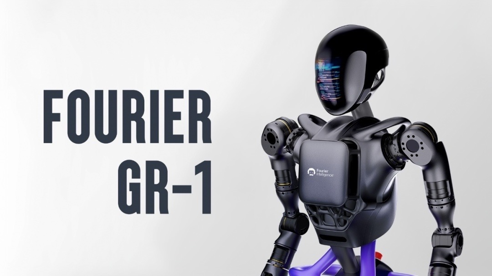

gros-client / [Exports](modules.md)

# 傅利叶通用机器人系统-客户端SDK（Javascript/Typescript）


* [源码](https://github.com/FFTAI/gros_client_js.git)
* [文档](modules.md)

## 概述
    本例(GROS Client SDK)适用于您已经拥有傅利叶（Fourier）所提供的机器人设备，通过本例可实现对机器人的控制。它提供了一组简单的API，让你可以轻松地与机器人进行交互。

## 历程

| 版本号 | 作者     | 日期     | 描述                           | 快速预览                                       |
|-----|--------|--------|------------------------------|--------------------------------------------|
| 0.1 | 傅利叶软件部 | 2023.8 | 1. 立项<br/>2. 确认基础架构          | [0.1说明](https://fftai.github.io/v0.1.html) |
| 0.2 | 傅利叶软件部    | 2023.9 | 1. 控制模块、系统模块<br/>2. 具体coding | [0.2说明](https://fftai.github.io/v0.2.html) |

## 快速上手

### 安装

```shell
npm install gros-client
```

### 使用方法
#### 导入sdk
首先你需要在你的代码中导入这个SDK

```javascript
import {Human} from 'gros-client';   
```
#### 创建机器人对象
然后，你需要创建一个机器人对象，以便使用这个SDK

```javascript
import {Human} from 'gros-client';  // 按需导入Human、同理还有Car、Dog等

let human = new Human({host: '192.168.9.17'});
```

### 控制机器人
你可以使用以下方法来控制机器人：

- start(): 回零/开启控制
- stop(): 急停（会掉电停止）
- exit(): 退出机器人控制
- stand(): 原地站立
- walk(angle, speed): 控制机器人移动、走路
    - angle(float): 角度 控制方向，取值范围为正负45度。向左为正，向右为负！(浮点数8位)
    - speed(float): 速度 控制前后，取值范围为正负0.8。向前为正，向后为负！(浮点数8位)
- head(roll, pitch, yaw): 控制GR-01人形头部运动
    - roll(float): roll（翻滚角）：描述围绕x轴旋转的角度，左转头为负，向右转为正，范围（-17.1887-17.1887）
    - pitch(float): pitch（俯仰角）：描述围绕y轴旋转的角度。前点头为正，后点头为负，范围（-17.1887-17.1887）
    - yaw(float): yaw（偏航角）：描述围绕z轴旋转的角度。左扭头为负，右扭头为正，范围（-17.1887-17.1887）

#### 示例代码
下面是一个完整的示例代码，演示如何使用这个SDK来控制机器人：

```javascript
import {Human} from 'gros-client';  

let human = new Human({host: '192.168.9.17'});      // 请将host替换为您所拥有设备的ip

human.start(); // 启动远程控制

setTimeout(() => {
    human.stand() // 站立
    human.walk(0, 0.1) // 以0.1的速度向正前方移动
    
    //  控制系统内置状态机。为了保证机器人的校准和启动正常，在start()指令之后建议10s再执行后续指令
}, 10 * 1000)
```
