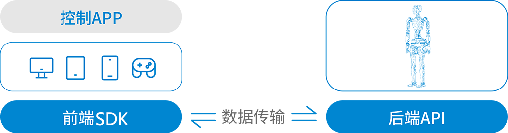

# 后端API

## 项目介绍

该文档旨在介绍机器人后端API所提供的接口的作用和使用方法，通过阅读该文档，可以学会利用API工具如PostMan或者ApiFox等工具Http工具发送Http
请求以控制机器人的基本行为。

## 硬件准备

* 傅利叶GR-1机器人

* 发送控制指令的PC电脑

* 用于提供同一局域网的路由器

## 软件准备

* PC电脑安装SSH链接工具
* PC电脑安装PostMan或者ApiFox等接口测试工具
* 如果纯代码操作，请安装Http、WebSocket工具包

## 操作步骤

* 通过链接wifi与机器人处于同一局域网
* SSH工具链接机器人，启动底层与后端server程序
* 在PC电脑用telnet命令验证机器人的8001端口是否已经开放
* 启动后端API应用

## 详细Api文档

* [server_api](server_api.md)