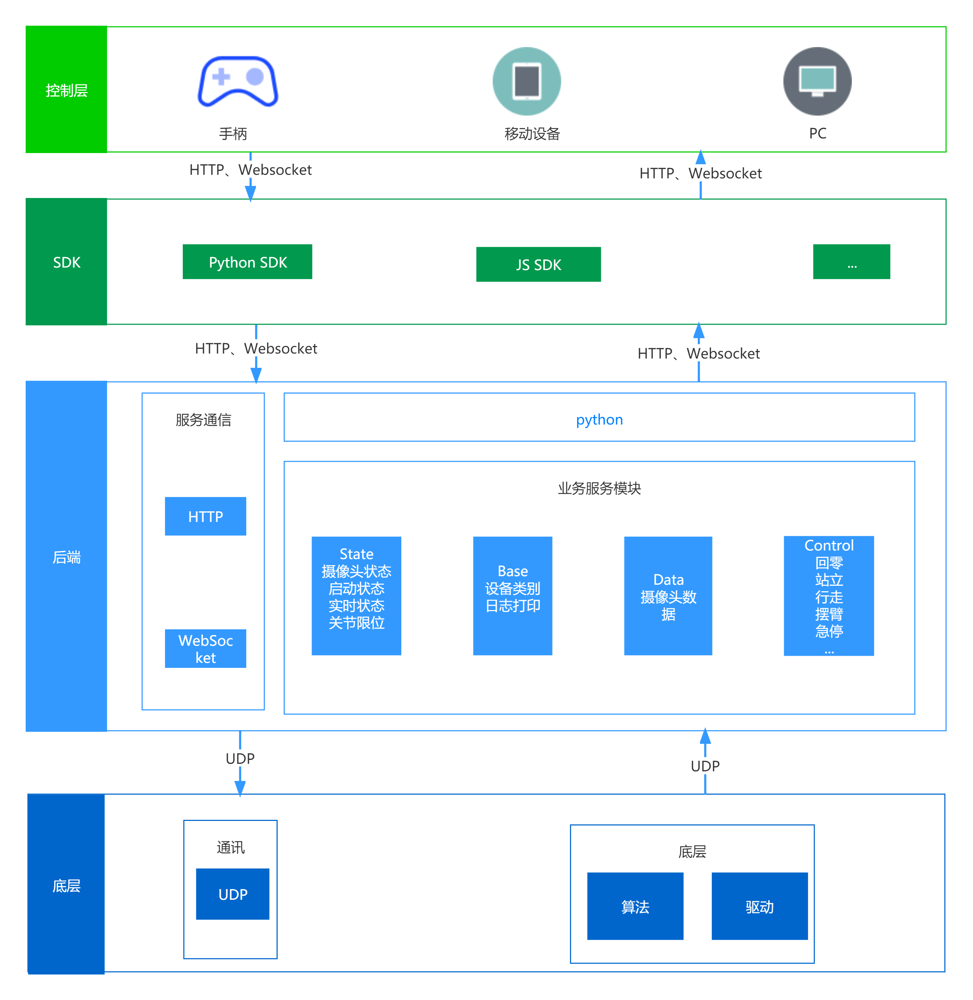

# 后端API

## 项目介绍

该文档旨在介绍机器人后端API所提供的接口的作用和使用方法，通过阅读该文档，可以学会利用API工具如PostMan或者ApiFox等工具Http工具发送Http
请求以控制机器人的基本行为。

## 硬件准备

* 傅利叶GR-1机器人

* 发送控制指令的PC电脑

* 用于提供同一局域网的路由器

## 软件准备

* PC电脑安装SSH链接工具
* PC电脑安装PostMan或者ApiFox等接口测试工具
* 如果纯代码操作，请安装Http、WebSocket工具包

## 操作步骤

* 通过链接wifi与机器人处于同一局域网
* SSH工具链接机器人，启动底层与后端server程序
* 在PC电脑用telnet命令验证机器人的8001端口是否已经开放
* 启动后端API应用

## 详细Api文档

* [server_api](server_api.md)

## PostMan具体示例（由于PostMan不支持Websocket，所以只展示Http操作）

* 下载并安装PostMan工具，官网下载地址:https://www.postman.com/downloads/
* 打开PostMan
* URL输入框输入http://[机器人IP]:8001/robot/type
* 点击 Send 按钮，可以收到后端API返回Json格式的响应数据

## Apifox具体示例

* 打开Apifox官网，官网下载地址:https://apifox.com/

* 打开Apifox，进入示例项目

* Http接口操作
    * 创建新的接口
    
    * URL输入框输入http://[机器人IP]:8001/robot/type，并填写接口名称
    
    * 填写接口入参的格式与参数内容，并保存接口
    
    * 发送请求，查看响应数据
    
* webocket接口操作
    * 添加Websocket接口
    
    * 填写URL、参数
    * 保存接口
    
    * 点击链接按钮，创建长连接
    
    * 发送请求报文数据
    