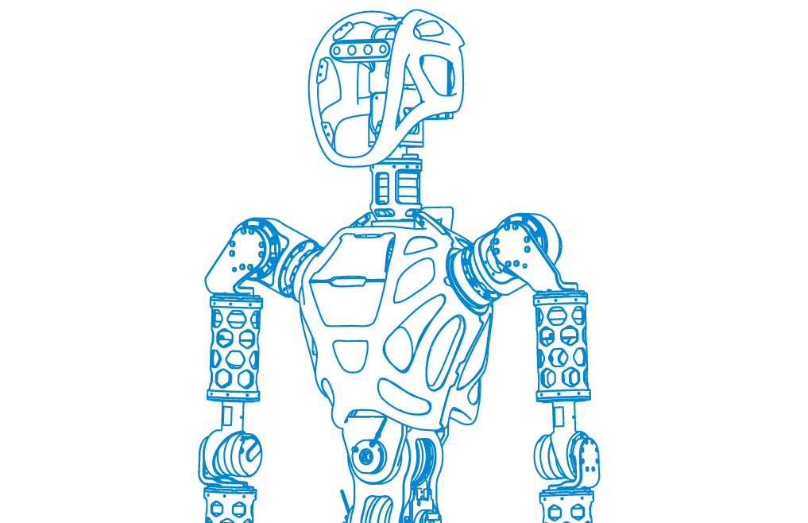
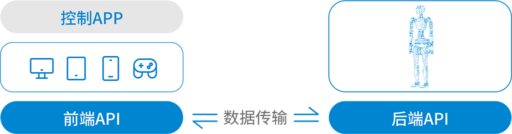
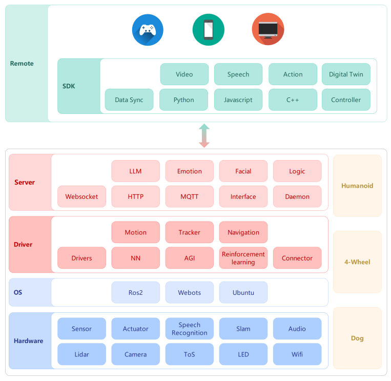

# 机器人遥控系统 GROS

`机器人遥控系统`负责机器人的整体遥控功能。分为三个部分：`控制App`（用户图形应用），`前端SDK`（客户端接口），`后端API`（服务器接口）。`控制App`运行在终端上（电脑或手机）是用户图形应用，通过集成`前端SDK`访问`后端API`。`后端API`运行在机器人上，负责转发机器人的运动命令和传感器数据等。拓扑图如下：  

---

---

## 系统架构图
系统目前支持三种类型的智能机器：
- 机器狗
- 四轮车
- 人形机器

每种类型的机器人都有自己的特点和功能，但也共享相同的模块和功能层。该系统分为四个功能层：
- 远程操控
- 服务系统
- 驱动程序
- 硬件

每个功能层包含不同的模块，负责不同的功能。架构图如下：

---

---

以下是各个功能层和模块的简要说明：

### 远程层
用户与智能机器人交互的接口，提供了以下模块：
 - SDK：软件开发工具包，提供了一系列的API，让用户可以自定义智能机器人的行为和功能。
 - Data Sync：数据同步模块，负责将用户的设置和指令发送给服务器，并接收服务器的反馈和数据。
 - Python：SDK支持Python语言开发
 - Digital Twin：数字孪生模块，提供了一个虚拟的智能机器人模型，让用户可以在远程观察和控制智能机器人的状态和动作。
 
### 服务层
智能机器人的核心，负责处理用户的请求和指令，并发送控制信号给驱动层，提供了以下模块：
 - Interface：接口模块，负责定义和管理服务器层与其他层之间的通信协议和数据格式。
 - Websocket：Websocket模块，负责与远程层建立双向通信连接，实现实时数据传输。
 - HTTP：HTTP模块，负责与其他网络服务进行交互，如云计算、数据库、第三方API等。
 - MQTT：MQTT模块，负责与其他智能设备进行通信，如智能家居、智能车等。
 - Emotion：情感模块，负责分析智能机器人的情绪状态，并根据情绪调整行为和表情。

### 驱动层
智能机器人的执行器，负责将服务器层的控制信号转换为硬件层的电信号，并接收硬件层的反馈信号，提供了以下模块：
 - Drivers：驱动器模块，负责驱动硬件层的传感器和执行器，并提供相应的接口和函数。
 - Connector：连接器模块，负责连接驱动层与硬件层之间的电路，并提供相应的标准和规范。
 - Motion：运动模块，负责规划和控制智能机器人的运动轨迹和姿态，并提供相应的算法和参数。
 - AGI：人工通用智能模块，负责实现智能机器人的自主学习和决策，并提供相应的框架和方法。
 - Tracker：跟踪模块，负责跟踪智能机器人的位置和方向，并提供相应的技术和设备。
 - Reinforcement：强化模块，负责给予智能机器人正向或负向的奖励或惩罚，并提供相应的策略和机制。

### 硬件层
智能机器人的物理部件，包括传感器、执行器、语音识别、定位导航、音频和外形，提供了以下模块：
 - Sensor：传感器模块，负责采集智能机器人的内部和外部的环境信息，并提供相应的数据和信号。
 - Actuator：执行器模块，负责执行智能机器人的动作，并提供相应的力和效果。
 - Speech Recognition：语音识别模块，负责识别用户的语音指令，并提供相应的文本和意图。
 - Slam：定位导航模块，负责定位智能机器人的位置和地图，并提供相应的路径和方向。
 - Audio：音频模块，负责播放智能机器人的语音和音效，并提供相应的声音和品质。

## 后端 API
[后端api 文档](docs/server_api/readme.md)  

## 前端 SDK

[javascript版文档](docs/sdk_js/readme.md)  [代码](https://github.com/FFTAI/gros_client_js) 

[python版文档](docs/sdk_py/readme.md)  [代码](https://github.com/FFTAI/gros_client_py)

## 控制 App
[文档](https://docs/app/readme.md)  [代码](https://github.com/FFTAI/gros_app)  

## 历史版本
[v0.1 发布描述](v0.1.md)

[v0.2 发布描述](v0.2.md)