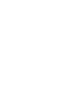

  

  Where Precision Fuses with Robotic Mastery.

# A Comprehensive Overview of the Robot Control System (RoCS)

## Introduction

The Robot Control System, known as RoCS, is an advanced software framework designed for precise management and control of robotic systems. It consists of two primary components: the upper computer and the lower computer.

## Lower Computer

The lower computer, functioning as the analog of the cerebellum in human physiology, specializes in tasks related to motion control. It is responsible for motor control, motion algorithms, hardware driver management, and other critical functions essential for the robot's movement and stability.

## Upper Computer

Conversely, the upper computer is primarily dedicated to seamless data exchange and executing specific logic applications. Its role encompasses tasks such as receiving and playing audio, real-time transmission of video streams, dispatching precise instructions to the robot's hardware components, and continuous monitoring of the robot's operational status.

## Layers of the Robot Control System

The Robot Control System is structured into three distinct layers, each serving a unique and pivotal role:

1. **Control App (User Graphic Application):**

   The Control App is an intuitive graphical application tailored for use on terminals external to the robot's physical body, such as computers and mobile devices. Its primary function is to serve as a comprehensive reference for developers, rather than as a consumer-facing application.
2. **Client SDK (Client Interface):**

   The Client SDK represents the client-side interface, facilitating interaction with the Robot Control System. It provides developers with a streamlined mechanism for accessing the Server API, thereby enabling the development of customized applications. This layer is open-source, encouraging the development community to create tailored solutions.
3. **Server API (Server Interface):**

   Operating within the confines of the robot, the Server API assumes the role of a lightweight data forwarding layer. It leverages HTTP and WebSocket protocols to facilitate the seamless transmission of external commands to the lower computer and the transmission of essential robot data to external entities. Despite its location within the robot, the Server API is considered an integral part of the upper computer. However, due to efficiency and security concerns, it is not available as open-source software.

The Server API essentially serves as the crucial conduit between the core functions of the lower computer and the external world, ensuring the efficient and secure exchange of data.

## Conclusion

In summation, the collective elements of the upper computer, encompassing the Control App, Client SDK, and Server API, collectively comprise the Robot Control System, or RoCS. This comprehensive framework equips developers and operators with the tools necessary for efficient and precise monitoring and remote control of robotic systems, thereby ensuring their seamless and optimal operation.

Docsify turns one or more Markdown files into a Website, with no build process required.

## Features

- No statically built html files
- Simple and lightweight
- Smart full-text search plugin
- Multiple themes
- Useful plugin API
- Support embedded files

## Quick Start

Get going fast by using a static web server or GitHub Pages with this ready-to-use [Docsify Template](https://github.com/docsifyjs/docsify-template), review the [quick start tutorial](https://docsify.js.org/#/quickstart) or jump right into a CodeSandbox example site with the button below.

## Showcase

A large collection of showcase projects are included in [awesome-docsify](https://github.com/docsifyjs/awesome-docsify#showcase).

## Links

- [Documentation](https://docsify.js.org)
- [Docsify CLI (Command Line Interface)](https://github.com/docsifyjs/docsify-cli)
- CDN: [UNPKG](https://unpkg.com/docsify/) | [jsDelivr](https://cdn.jsdelivr.net/npm/docsify/) | [cdnjs](https://cdnjs.com/libraries/docsify)
- [`develop` branch preview](https://docsify-preview.vercel.app/)
- [Awesome docsify](https://github.com/docsifyjs/awesome-docsify)
- [Community chat](https://discord.gg/3NwKFyR)

## Contributing

See [CONTRIBUTING.md](./CONTRIBUTING.md).

## Backers

Thank you to all our backers! 🙏 [[Become a backer](https://opencollective.com/docsify#backers)]

## Sponsors

Thank you for supporting this project！❤️ [[Become a sponsor](https://opencollective.com/docsify)]

## Contributors

This project exists thanks to all the people who contribute. [[Contribute](CONTRIBUTING.md)].
`<a href="https://github.com/docsifyjs/docsify/graphs/contributors">``</a>`

## License

[MIT](LICENSE)

## Special Thanks

A preview of Docsify's PR and develop branch is `<a href="https://vercel.com/?utm_source=docsifyjs&utm_campaign=oss" target="_blank">`Powered by `</a>`
