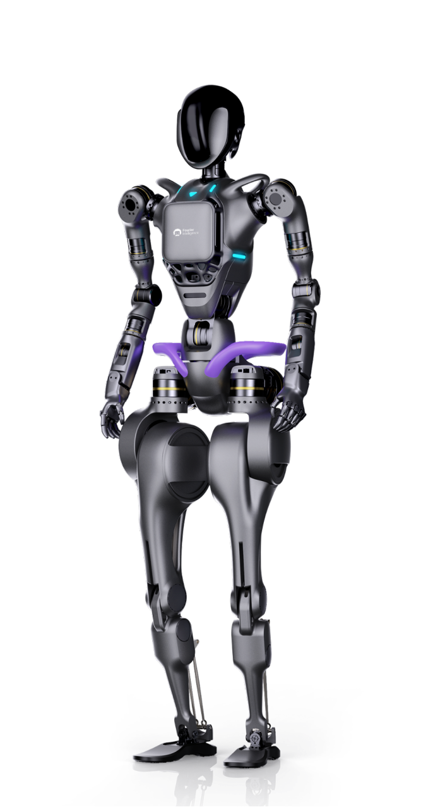

# Concepts

This documentation is intended to guide you for the extended development of GR-1 based on the SDK provided.

Two approaches are provided to connect and control the GR-1 robot:

* Through virtual environment Webots
* Throug physical robot

For the development using virtual environment, refer to [About Fourier GR-1](#about-fourier-gr-1about_gr_1).

For the development using physical robot, refer to xxx.

## About Fourier GR-1``about_gr_1

Fourier GR-1 is a general-purpose humanoid robot. It is composed of up to 40 FSA joints, which can provide 230 N.m peak joint torque.  The whole body controll algorithm enables 44 full-body degrees of freedom.

Its human-like agility and motion kinematics, such as:

* Straight leg walking
* Fast walking
* Agile obstacle evasion
* Steady slope ascending and descending
* Resilient impact disturbance response
* Human-robot collaboration in task execution

makes it a potential carrier for the next-generation "Embodied AI", which would combine AI technology with physical robots to provide controllable, perceptible, interactive, and mobile entities.

The Fourier GR-1 offers scalability for validating various AI models and algorithms, with significant potential in industrial, rehabilitation, home, and research applications.

# A Comprehensive Overview of the Robot Control System (RoCS)

## Introduction

The Robot Control System, known as RoCS, is an advanced software framework designed for precise management and control of robotic systems. It consists of two primary components: the upper computer and the lower computer.

## The Lower Computer

The lower computer, functioning as the analog of the cerebellum in human physiology, specializes in tasks related to motion control. It is responsible for motor control, motion algorithms, hardware driver management, and other critical functions essential for the robot's movement and stability.

## The Upper Computer

Conversely, the upper computer is primarily dedicated to seamless data exchange and executing specific logic applications. Its role encompasses tasks such as receiving and playing audio, real-time transmission of video streams, dispatching precise instructions to the robot's hardware components, and continuous monitoring of the robot's operational status.

## Layers of the Robot Control System

The Robot Control System is structured into three distinct layers, each serving a unique and pivotal role:

1. **Control App (User Graphic Application):**

   The Control App is an intuitive graphical application tailored for use on terminals external to the robot's physical body, such as computers and mobile devices. Its primary function is to serve as a comprehensive reference for developers, rather than as a consumer-facing application.

2. **Client SDK (Client Interface):**

   The Client SDK represents the client-side interface, facilitating interaction with the Robot Control System. It provides developers with a streamlined mechanism for accessing the Server API, thereby enabling the development of customized applications. This layer is open-source, encouraging the development community to create tailored solutions.

3. **Server API (Server Interface):**

   Operating within the confines of the robot, the Server API assumes the role of a lightweight data forwarding layer. It leverages HTTP and WebSocket protocols to facilitate the seamless transmission of external commands to the lower computer and the transmission of essential robot data to external entities. Despite its location within the robot, the Server API is considered an integral part of the upper computer. However, due to efficiency and security concerns, it is not available as open-source software.

The Server API essentially serves as the crucial conduit between the core functions of the lower computer and the external world, ensuring the efficient and secure exchange of data.

## Conclusion

In summation, the collective elements of the upper computer, encompassing the Control App, Client SDK, and Server API, collectively comprise the Robot Control System, or RoCS. This comprehensive framework equips developers and operators with the tools necessary for efficient and precise monitoring and remote control of robotic systems, thereby ensuring their seamless and optimal operation.

## About Robot Control System (RoCS)

In general, our softwares are divided into two parts: the upper computer and the lower computer.

* The lower computer is like the cerebellum in humans, mainly responsible for motion control related tasks such as motor driving, motion algorithms, hardware drivers, etc.
* The upper computer mainly focuses on data transmission and a small amount of logic applications. For example, receiving and playing sound, video stream transmission, sending instructions, receiving status, etc.

The **Robot Control System** is responsible for the overall monitoring and remote control functions of the robot. It is divided into three layers:
**Control App** (user graphic application), **Client SDK** (client interface), **Server API** (server interface).

* **Server API** runs on the robot and is a thin data forwarding layer. It uses `http` and `websocket` protocols to forward external commands to the lower computer and various data from the robot to the outside. Although it runs inside the robot, this layer is also part of the upper computer. It is the interface between the lower computer and the outside world. Because this time it is just a forwarding layer, and considering efficiency and other users' security, it has not been open-sourced.
* **Client SDK** can use any tool (as long as it supports `http` and `websocket` protocols) to access the **Server API**. But for developers' convenience, we provide the **Client SDK**, which encapsulates the **Server API**, providing a more friendly interface. Developers can directly use the corresponding language's **Client SDK** to develop their own applications. This layer is open-source.
* **Control App** runs on terminals outside of the robot body (computers or mobile phones) and is a user graphic application. The purpose of the **Control App** is not to provide a complete consumer-oriented application, but to make all functions into a comprehensive example for developers' reference. Developers can refer to the code of the **Control App** to develop their own applications. This layer is also open-source.

All upper computer software together is called `RoCS`, which stands for:
**Ro**bot **C**ontrol **S**ystem

---

## Contents

[About GR-1](contents/about_gr_1.md)
[Quick Start](contents/quick_start.md)
[Software Architecture](contents/soft_arc.md)
[Remote Application](contents/app/readme.md)
[Autonomous Control](contents/auto_ctrl.md)
[Embody](contents/embody.md)
[Motion Library](contents/motion_lib.md)

## SDKs

[Javascript SDK](https://github.com/FFTAI/rocs_client_js/blob/main/README.md)
[Python SDK](https://github.com/FFTAI/rocs_client_py/blob/main/README.md)

## Server

[Server API](server/readme.md)

## Release Notes

[v1.1 notes](release/v1.1.md)
[v0.2 notes](release/v0.2.md)
[v0.1 notes](release/v0.1.md)
